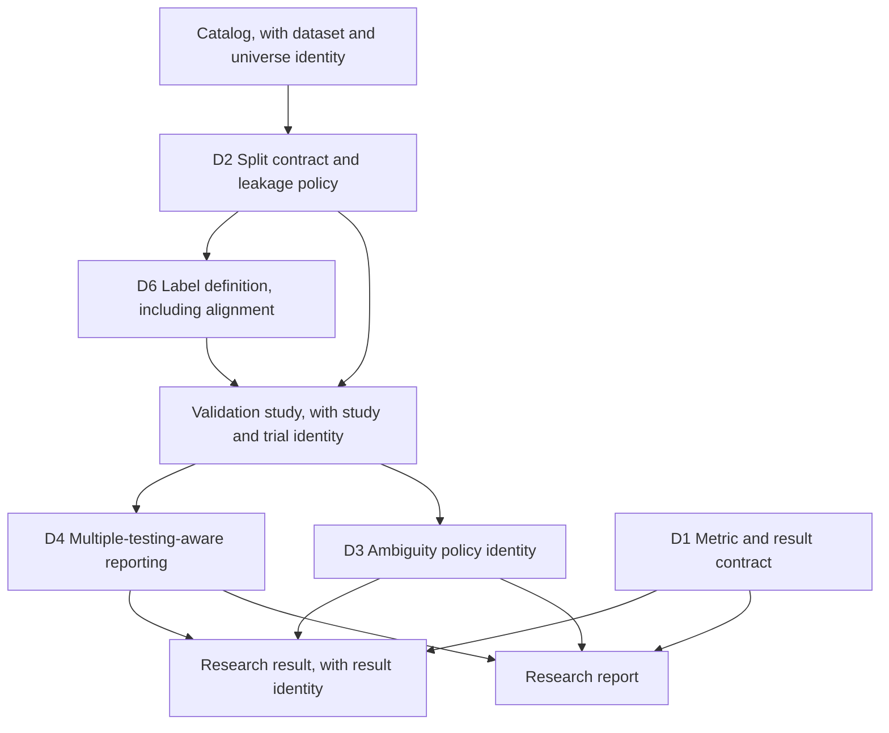

# VectorBT capability review: research-integrity mechanisms

Companion to [`vectorbt_lessons_implementation.md`](vectorbt_lessons_implementation.md) and to the
earlier [`vnpy_lessons_design.md`](vnpy_lessons_design.md). Throughout, the library is called
vectorbt; the community edition is distinguished from VectorBT PRO wherever the difference matters.

**Primary invariant.** vectorbt contributes mechanisms to the research and analysis layers of this
architecture; it does not dictate the architecture of those layers, and no vectorbt code may enter
this repository (section 1.2). Every item below is stated as a gap in NautilusTrader that vectorbt
either exposes or closes, never as a port of a vectorbt subsystem.

**Status.** Architecture approved; contracts under revision. The probe changed no production code,
because the authorising instruction permits code changes only for defects and none were found
(section 5.1 of the companion document). The owner then authorised implementation in the order of
section 12. **D1, D2 and D3 are implemented** (sections 4.1, 4.2 and 4.3 of the companion document
record them), and **the identity contracts of section 8 are implemented** (section 4.11 of the
companion document records them, including which fields were pruned); every other item here is
specified and ordered but marked **not implemented**. The identity contracts in section 8 are the centre of gravity: they are cross-cutting,
they sit underneath the decisions rather than beside them, and the remaining sections are read as
their consequences.

### Revision summary

| Revision | Change                                                                                                                                                                                                                                                                                                                                                                                                                                                                                                                                                                                                                                                                                                                                                                                                                                                          |
| -------- | --------------------------------------------------------------------------------------------------------------------------------------------------------------------------------------------------------------------------------------------------------------------------------------------------------------------------------------------------------------------------------------------------------------------------------------------------------------------------------------------------------------------------------------------------------------------------------------------------------------------------------------------------------------------------------------------------------------------------------------------------------------------------------------------------------------------------------------------------------------- |
| 1        | Initial review: eleven decisions extracted from the probe                                                                                                                                                                                                                                                                                                                                                                                                                                                                                                                                                                                                                                                                                                                                                                                                       |
| 2        | Decisions renumbered and classified by layer; the deflated Sharpe ratio rescoped to a first statistic behind a trial-provenance requirement; leakage became a policy with optional values; the ambiguity resolution became a versioned policy; metrics gained a direction; labels split into tranches; caching deferred; the provider adapter relocated; study identity added                                                                                                                                                                                                                                                                                                                                                                                                                                                                                   |
| 3        | Identity promoted to a first-class contract section covering study, trial, dataset, universe and result, with the trial level made explicit; the D1/D3/D4 graph split into a contract graph and a work order, so the graph no longer contradicts its own explanation; the leakage policy gained an exclusion relation rather than a time distance alone; the ambiguity default became an owner decision separate from the policy contract, and ambiguity was separated from execution simulation; the statistical contract for the correction was specified; the stability obligation was classified by kernel type; the metric status vocabulary gained `invalid`; capability codes became domain-scoped; the label definition gained an alignment convention; a no-decision-authority invariant was added; two identity questions were added to the open list |
| 4        | D2 implemented after the owner authorised the work order: the split contract and the leakage exclusion relation now exist in `nautilus_trader.optimization.splits`, the walk-forward stages consume the contract with their windows unchanged, and the policy is reachable from the configuration document. No other decision changed status. Section 4.2 of the companion document records the implementation, its deviations and its verification                                                                                                                                                                                                                                                                                                                                                                                                             |
| 5        | D1 implemented: the metric vocabulary is closed and declared (units, tags, action-oriented directions with an optional target, inputs, four statuses and seven reason codes), every statistic declares a `MetricDefinition`, and report methods keep every requested metric visible with a status and a reason. Question 6 of section 14 is answered by the implementation as a replaceable proposal, and section 4.1 of the companion document records the two deviations                                                                                                                                                                                                                                                                                                                                                                                      |
| 6        | D3 implemented: the bar-derived assumptions have an identity (`BarAmbiguityPolicy` with a policy id, a version, closed vocabularies for the intrabar path, trigger precedence, trigger fill and gap handling, and a digest), a study declares them under `assumptions` in a configuration file, an ambiguous declaration is a configuration error, and the resolved policy is recorded in the emitted result document. No Rust behaviour changed and the default is named as the existing behaviour, so question 1 of section 14 is answered as a status quo the owner may replace                                                                                                                                                                                                                                                                              |

## 1. Purpose and scope

vectorbt is a mature vectorized research and backtesting library with a substantial research and
validation surface. Version 1.1.1 is not the library it was in 2020: it now carries a Rust engine
beside its Numba kernels, dispatches between them at call time, and ships a test suite larger than its
library code. It is therefore relevant to this project twice over, as a source of research-layer
mechanisms and as a worked example of governing two implementations of the same numerics.

The question this review asks is: **which research-integrity and validation mechanisms should this
project acquire, given what vectorbt implements and what this project already is.**

### 1.1 No market-specific semantics

This review introduces no market-specific semantics. Every accepted item is a statistical,
validation, engineering or process mechanism, and none of them touches a market rule. Where an item
would have touched one, it was removed: the data-provider contract was moved out of this document
(section 13, D10) precisely because provider integration is a data-architecture concern in which the
market question does arise. The research layer may record execution assumptions without owning
execution semantics, and the distinction is drawn explicitly in D3. Market-rule concerns remain owned
by the instrument, calendar, venue and data layers.

### 1.2 The licence and provenance boundary

NautilusTrader is licensed **LGPL-3.0-only**. vectorbt is licensed **Apache-2.0 with Commons
Clause**, which the project describes as "Fair Code", and the GitHub API reports its SPDX identifier
as `NOASSERTION`.

The engineering rule, stated as a boundary rather than as a legal opinion: **no vectorbt source code,
dependency, copied documentation, test fixture, or mechanically derived implementation may enter this
repository.** **No implementation artifact may be derived by mechanical transformation of vectorbt
source, tests, fixtures or documentation.** Whether any particular use of the licence is permissible
is a question for a licensing review, not for a design document, and this document does not attempt
to answer it.

Independence is maintained by a provenance chain, and an adopted mechanism must be able to show every
link of it. The chain is the auditable test, because "paraphrased" is not:

```text
observed mechanism
      |
our own requirement, stated in our own terms
      |
our own interface
      |
our own mathematical specification
      |
our own implementation
      |
our own tests
```

### 1.3 Preconditions

This document assumes three placement decisions that are larger than any item in it, and that are
owned elsewhere. If any of them is answered differently, this document changes rather than the
answer:

1. **The research layer belongs in this repository.** Otherwise most items below have no home.
2. **The research layer may depend on the data catalog.** It reads catalog data and emits derived
   data; it does not own storage.
3. **The research layer has no decision authority and no live execution authority** (invariant 7.6).

These are recorded here as a gate, not as an open question in section 14.

## 2. Method and evidence

The review was performed against source at a pinned revision, not against documentation.

| Source           | Revision                                                  | Size                                                                        |
| ---------------- | --------------------------------------------------------- | --------------------------------------------------------------------------- |
| `vectorbt`       | `ceffc501f2d37033a79dd86a9f883e69ec6977bd`, version 1.1.1 | 118 Python files, 105,199 lines including tests; 8 Rust files               |
| `vectorbt` tests | same revision                                             | 16 files, 36,259 lines (`test_portfolio.py` 10,831, `test_engine.py` 2,543) |
| `vectorbt-rust`  | crate version 1.1.1, same revision                        | pyo3 0.29, numpy 0.29, ndarray 0.17, rand 0.10                              |

External metadata came from the GitHub REST API: 9,242 stars, 1,183 forks, created 2017-11-14, last
push 2026-09-26; releases v1.1.1 (2026-09-26), v1.1.0 (2026-07-05), v1.0.0 (2026-04-22, which
introduced the Rust engine), v0.28.5, v0.28.4. The clone was a shallow checkout of `master` and was
removed after the record was written.

Claims in the companion document are cited by path and line against that revision. Claims about this
repository were verified against the working tree at code revision `d71348e30a`; the commits after it
in this branch are documentation only, so the code citations remain current. Coverage of the review
was:

- read in full: `vectorbt/generic/splitters.py`, `vectorbt/_engine.py`, `rust/README.md`, `LICENSE.md`, `pyproject.toml`, the getting-started pages, and the structure of `tests/test_engine.py`;
- read in part, by mechanism: the portfolio simulation kernels and their parameter surface, the
  signal and indicator factories, the statistics builder, the returns and drawdown analytics, the
  labels module, the data container and updater, and the configuration and caching utilities;
- not reviewed: `vectorbt/plotting` and the notebooks, `apps/`, `benchmarks/`, and VectorBT PRO,
  which is closed source and paid.

## 3. What vectorbt is mechanically

Two properties explain almost every decision below, and the rest of the description exists only to
establish why particular mechanisms do not transfer.

- **A matrix research library.** The unit of work is an array whose columns are instruments or
  parameter combinations. There is no clock, no queue, no venue, no live path, and no accounting
  authority; a backtest is a compiled kernel over arrays and a parameter sweep is a wider array.
- **Two implementations of the same numerics.** Since v1.0.0 every hot kernel has a Numba twin and a
  Rust twin, with a resolver that decides per call which one runs.

Everything else follows from the first property: records are structured arrays with analytic views on
top, behaviour is attached to pandas objects as accessors, and extension points are factories that
turn a declaration into a class. Those are good answers to a different question, which is why they are
excluded in section 7.2 rather than compared in detail.

The second property is a process contribution rather than a feature contribution: vectorbt is the
inverse of this project, and in inverting it, it documents the rules that make two implementations
survivable.

## 4. Capability taxonomy

The taxonomy decides provenance and layer classification.

| Area                                 | What vectorbt has                                                                                                                                            | Where it sits                                               | Layer        |
| ------------------------------------ | ------------------------------------------------------------------------------------------------------------------------------------------------------------ | ----------------------------------------------------------- | ------------ |
| A Execution and portfolio simulation | Signal and order simulation, stops, sizing, fees, slippage, cash, grouping, conflict policies                                                                | A research approximation of what this project does for real | Not adopted  |
| B Signal and indicator generation    | A declaration factory, parameter grids, ranking and index statistics, TA-Lib and pandas-ta adapters                                                          | Research ergonomics                                         | Not adopted  |
| C Statistics and analytics           | A declarative metric registry, preset statistics per object, rolling twins, drawdown records, empyrical-derived return metrics, a deflated Sharpe ratio      | Research and analysis                                       | D1, D4       |
| D Validation and optimization        | Three splitter classes over a generator contract, parameter grids, an advertised purged cross-validation in the paid edition only, no optimizer              | Research integrity                                          | D2           |
| E Data ingestion and storage         | A `Data` container contract, provider subclasses, a scheduler-driven updater, no on-disk cache in the community edition                                      | Data architecture, relocated                                | D10          |
| F Configuration and serialization    | A nested dict-like `Config`, a bespoke pickle layer, a global settings tree                                                                                  | Engineering, weaker than ours                               | Warning only |
| G Engineering process                | A dual-engine resolver, a documented kernel-addition process, parity and fallback tests, a published benchmark harness, test volume exceeding library volume | Engineering policy                                          | D5, D7, D8   |
| H Presentation                       | Plotly figures, widgets, dashboards, image helpers                                                                                                           | Out of scope by construction                                | Not adopted  |

The layer distinction matters for the rest of this document. A **research-integrity** mechanism
changes what a reported research result means. An **engineering-policy** mechanism changes how the
code that produces it is written. They are adopted for different reasons, owned by different work, and
phased separately. D7 is not a prerequisite for running research, and the classification exists to
prevent exactly that reading.

## 5. Where NautilusTrader stands

Verified against the working tree; the row-level evidence is in section 3 of the companion record.

| Capability                                                   | This project                                                                                     | vectorbt                                                                     |
| ------------------------------------------------------------ | ------------------------------------------------------------------------------------------------ | ---------------------------------------------------------------------------- |
| Multiple implementations of one kernel                       | None; the compiled extension is mandatory and owns the hot paths                                 | Numba and Rust twins with a runtime resolver                                 |
| Documented protocol for adding a second kernel               | Absent                                                                                           | Six-step process in `rust/README.md`                                         |
| Version compatibility between the two halves                 | Asserted at build time from the Python version prefix                                            | Checked at run time on the major/minor prefix                                |
| Capability probing with a machine-readable reason            | Present for order denial (`OrderDeniedReason` and a code enum)                                   | Present for engine support, with a free-text reason                          |
| Statistics registry                                          | Present: a `PortfolioStatistic` trait, a name-keyed map, 34 statistics, 20 registered by default | Present: a declarative metric config per class                               |
| Metric presentation metadata (title, units, tags, direction) | Absent; parameters are baked into the display name                                               | Present, except direction                                                    |
| Reason reported when a statistic cannot be computed          | Absent; the calculation returns `None` and the metric is dropped                                 | A warning is emitted with the reason                                         |
| Rolling twins of statistics                                  | Absent in the analysis crate                                                                     | Every return metric has a rolling twin                                       |
| Walk-forward windows                                         | Present as explicit optimization stages                                                          | Present as splitter classes                                                  |
| Reusable split contract, any length and any number of sets   | Absent                                                                                           | Present: three splitters over one generator contract                         |
| Purging and embargo                                          | Absent                                                                                           | Absent in the community edition; advertised in the paid edition              |
| Trial provenance for a research result                       | Partial: a canonical digest and a run record exist; a study or trial identity does not           | Absent                                                                       |
| Point-in-time dataset and universe identity                  | Membership workstream proposed in the earlier review; no identity contract                       | Absent                                                                       |
| Multiple-testing correction                                  | Absent                                                                                           | A deflated Sharpe ratio                                                      |
| Supervised labels                                            | Absent; proposed only in the earlier design document                                             | Five label policies plus four future-aggregate primitives                    |
| Bar-level ambiguity policy                                   | Documented and configurable, but the policy has no identity in the result                        | Pessimistic resolution, with ambiguous settings rejected                     |
| Numeric-stability test category                              | Goldens pinned; adversarial inputs not targeted                                                  | Targeted: three stability defects and one bounds defect fixed in one release |
| Data container contract with provider subclasses             | Absent; the catalog is the abstraction                                                           | Present, with per-symbol argument dispatch                                   |
| Dataset coverage and gap reporting                           | Present and mature in the catalog                                                                | Absent; the updater only refreshes                                           |
| Typed configuration with all-errors validation               | Present                                                                                          | Dict-like, validated by assertion                                            |
| Persistence format                                           | Parquet catalog with consolidation and coverage                                                  | Whole-object pickle                                                          |
| On-disk caching of market data                               | Present                                                                                          | Absent in the community edition                                              |

Two rows invert the intuition that a mature library must be ahead. Storage and configuration are
better here, and the reason is structural: this project has a typed Rust core and a catalog, while
vectorbt is a library over pandas that must not own a database.

## 6. Comparison and the structural difference

vectorbt is a research instrument: it exists to evaluate many ideas quickly, and it optimises for
throughput of experiments. This project is an execution platform with a research surface: it exists to
run the same idea in simulation and in production, and it optimises for the identity of the two.

Three consequences follow, and they explain why the accepted list is short.

1. **Most of vectorbt is not applicable, and not because it is bad.** Broadcasting parameter grids,
   accessor-driven APIs, presentation-heavy notebook artifacts and factory-generated indicator
   classes are excellent for a notebook and wrong for a live engine. They are excluded in section 7.2.
2. **Where the two projects agree, the agreement is evidence.** Both reconstruct per-trade analytics
   from an order log rather than from live state, and vectorbt asserts that its three trade views
   agree in total PnL. That is the same discipline as the accounting authority here, and the earlier
   review recorded it as a canonical-accounting decision. The overlap is treated as confirmation, not
   as a new item.
3. **Where vectorbt is silent, the silence is informative** (section 10). It has no queue position,
   no intrabar path, no depth and no multiple-testing machinery beyond one ratio, which is why it
   cannot serve as the reference architecture for this project.

## 7. Architectural invariants

### 7.1 State ownership

| State                                     | Owner                                                                    |
| ----------------------------------------- | ------------------------------------------------------------------------ |
| Live execution, order and position state  | The engine and the portfolio (unchanged)                                 |
| Bar, tick and instrument data             | The data catalog (unchanged)                                             |
| Derived research arrays                   | The research layer, as a pure function of catalog data                   |
| Metric definitions                        | The analysis layer, as registry entries                                  |
| Split membership                          | Computed per study from the split contract, never persisted as the truth |
| Study, dataset, trial and result identity | The research layer, recorded with every result (section 8)               |

A research component may read catalog data and emit derived data. It may not hold position state, may
not be reachable from the live path, and may not become a second accounting authority.

### 7.2 Mechanisms that must not enter

- **A runtime engine switch.** Bound at build time, not chosen at call time (D7).
- **Broadcast parameter grids as a core abstraction.** A parameter sweep is an optimization concern,
  already expressed by the parameter space and the search strategy.
- **Attribute magic on analysis objects.** No `__getattr__`-driven metric access; a metric is a
  registry entry or a method.
- **Pickle as the persistence protocol for configuration.** Typed configuration with serde
  round-trips already exists.
- **Look-ahead values reachable from the live path.** Labels are quarantined to the research path (D6).
- **Presentation artifacts inside the analysis crates.**
- **Any vectorbt code, dependency, copied text or fixture** (section 1.2).

### 7.3 Licence and provenance

NautilusTrader is LGPL-3.0-only; vectorbt is Apache-2.0 with Commons Clause and is reported by the
GitHub API as `NOASSERTION`. Therefore no source file, code fragment, docstring, table, test case or
data file from vectorbt may be copied, vendored, transliterated or mechanically derived into this
repository, and no dependency on the package may be introduced. Mechanisms in this document are
described in prose, re-derived from the requirement they serve, and attributed to the source that
exposed them. The provenance chain in section 1.2 is the test: if a link cannot be shown, the
mechanism is not adopted.

### 7.4 Verification invariants

- **Independent views must agree.** Where the same fact can be derived more than once, the
  derivations are compared. vectorbt asserts that entry-trade, exit-trade and position views of the
  same order log agree in total PnL. This project has the same obligation through the accounting
  authority and the parent/child conservation invariant recorded in the earlier review, and any new
  research analytic is subject to it.
- **Every ambiguity is resolved explicitly, by an identified policy.** When the data cannot determine
  an outcome, the resolution is documented, is carried by a policy with an identity, and the identity
  is recorded in the result (D3). Whether that policy is pessimistic is a property of the selected
  default, not of the contract.

### 7.5 Report integrity

- A statistic that cannot be computed is reported with a status and a reason, never as zero and never
  as silence (D1).
- A research result that reports a performance figure must record how many trials produced it and
  what the trials were over, so a multiple-testing correction can be applied later even if it is not
  applied now (D4).
- A research result must identify the assumptions under which it was produced, and the identity of
  the policy that made them (D3).

### 7.6 No decision authority

Research metrics, labels, validation statistics and multiple-testing diagnostics describe research
results. They **do not** authorize orders, change live portfolio state, or override execution or risk
controls.

This is the general form of the rule recorded in D4: a value is reported, never a gate. It applies to
the whole research layer unless a separate architecture explicitly promotes something into a risk or
decision component, and that promotion is a risk-layer decision, not a research-layer one. A research
component must therefore not be importable from the live path, and no live component may read a
research metric as a control input.

## 8. Identity contracts

**Status.** Implemented in revision 7: `python/nautilus_trader/optimization/identity.py` holds the
contracts, their digests and the bridges from an objective's terms, a split contract and an optimizer
run. The field lists were pruned rather than filled in, the counts were moved out of the study
identity, and the dataset and universe fields are declarations their caller makes because the
repository has no dataset digest, no point-in-time read and no stored membership. The companion
document's section 4.11 records the pruning, its reasons and the verification.

Identity is the centre of the design, not a logging concern: **provenance is part of the meaning of a
result.** This section defines the contracts that the decisions below consume, and it is cross-cutting
in that D1, D2, D3, D4 and D6 all express a part of it.

**The invariant.** *A research result must be reproducible from its study identity, its dataset
identity, its validation contract, its computation identity, its parameter identity and its
assumption policy.*

A result that cannot name the study that produced it, the data it read, the code and kernels that
computed it, the parameters it swept and the assumptions it made is not a research result; it is an
observation that cannot be audited, compared or reproduced.

Three levels are distinguished, because collapsing them loses exactly the information a multiple-testing
correction needs: a study may contain many trials, and knowing that 500 trials occurred is not knowing
which 500.

### 8.1 Study identity

```text
ResearchStudy
    study_id
    dataset_identity
    feature_definition
    label_definition
    split_contract
    leakage_policy
    parameter_space
    objective_definition
    selection_rule
    validation_policy
    metric_set
    study_seed
    trial_count
    failed_trial_count
```

`selection_rule` is part of the identity and not a convenience field. Maximising a Sharpe ratio,
maximising a Sharpe ratio subject to a drawdown constraint, and selecting the top decile and then
minimising drawdown are three different studies with the same data, and a result must say which rule
selected its winner.

### 8.2 Trial identity

```text
ResearchTrial
    trial_id
    study_id
    parameter_digest
    parameter_values
    seed
    execution_status
    objective_value
    result_digest
```

The trial level is what makes a trial count meaningful. It also makes the distinction between a
nominal and an effective trial count expressible: a sweep over twenty adjacent moving-average windows
is not twenty independent opportunities, and a correction that assumes independence while the study
did not provide it is wrong in a way that a reader cannot see from the result.

### 8.3 Dataset identity

```text
DatasetIdentity
    dataset_digest
    source_version
    as_of
    calendar_identity
    instrument_universe_identity
    adjustment_policy
    missing_data_policy
```

The principle is that a dataset identity must identify **the information state available to the
study**, not merely the bytes consumed. Two runs over byte-identical files can have different
information states if the universe membership, the calendar or the adjustment policy differs, and a
digest alone does not express that. This contract consumes the point-in-time and membership
workstream proposed in the earlier review (`vnpy_lessons_design.md`, D5 and D13), rather than
competing with it.

### 8.4 Universe identity

```text
UniverseIdentity
    universe_digest
    membership_policy_id
    membership_as_of
```

A study that says "the 500 largest by capitalisation" is not reproducible without the membership
timestamp, because that membership is different in every period. This is the same argument the
earlier review used for stored membership history: a rule evaluated today cannot recover an
instrument that has since left the universe.

### 8.5 Result identity

```text
ResearchResult
    study_id
    trial_id
    dataset_identity
    computation_identity
    assumption_policy
    metric_results
    result_digest
```

where the computation identity is:

```text
ComputationIdentity
    code_version
    schema_version
    kernel_version
    numerical_backend
    parameter_digest
```

The computation identity is not decoration. A result computed before and after a numerical change in
a kernel is not the same result, and without a kernel identity the difference is invisible until
someone reruns it and cannot explain the drift.

## 9. Candidate learnings

Provenance is recorded per item: **`vectorbt`** means vectorbt supplies the mechanism; **`vectorbt,
extended`** means the shape is adopted and the implementation rejected or widened; **`Comparison`**
means the requirement was exposed by the comparison and vectorbt does not close it; **`Existing
architecture, confirmed`** means the pattern is already ours and vectorbt merely agrees with it.

### L1 Metric identity is not metric presentation

**Status.** Implemented in revision 5: `crates/analysis/src/metric.rs` holds the closed vocabularies,
`MetricDefinition` and `MetricResult`, the `PortfolioStatistic` trait requires a `definition()`, all 34
built-in statistics declare one, and the analyzer reports every requested metric with a status and a
reason. The companion document's section 4.1 records what was built, its two deviations (the rendered
display string is preserved, and `definition()` is required rather than defaulted) and the
verification. The units, tags and direction membership is proposed by the implementation and remains
the owner's to replace.

vectorbt declares each statistic as data: a title for humans, a calculation resolved by name or
callable, an optional post-processing step, an aggregation function, tags, and filters that decide
whether the metric applies at all. Identity and title are separate, so a metric can be renamed or
translated without touching its calculation. The registry is per class and copied per instance.

This project registers statistics by name in a map and computes them through a trait whose entry
points return `Option`. Three weaknesses follow. Display names carry their parameters, so identity and
presentation are fused. There is no units, tags or direction metadata. And a statistic that cannot be
computed returns `None` and disappears from the result, so unavailable and unregistered are
indistinguishable.

The shape to aim for is a definition and a result:

```text
MetricDefinition
    id
    title
    units
    tags
    direction        maximize | minimize | target | informational
    applicability

MetricResult
    value
    status           computed | unavailable | invalid | not_registered
    reason_code
    metadata
```

Four statuses, not three, and they are semantically distinct: **computed** is a value; **unavailable**
means the inputs the definition requires were not present, such as insufficient periods or a missing
benchmark; **invalid** means the inputs were present and the computation could not produce a
meaningful value, such as a non-finite input or a zero denominator; **not_registered** means the
metric is not part of the metric set at all. Collapsing `invalid` into `unavailable` would hide a data
defect behind an applicability rule, and collapsing either into a dropped row is what happens today.

**Decision D1: adopt metric metadata, a four-state status and mandatory reason codes. Provenance:
`vectorbt, extended`.** Identity is stable and machine-facing; title, units, tags and direction are
declarative. Direction is action-oriented (`maximize`, `minimize`, `target`, `informational`) with the
target value carried by the definition, so a metric such as a tracking error or a distance to a
target is expressible without inventing a non-monotonic direction, and a metric such as drawdown is
plainly `minimize`. Reason codes come from a closed taxonomy, because a report consumer needs to
distinguish "not applicable here" from "the data is wrong". Rejected: string-path calculation
resolution, lambda post-processing, and warning-in-a-log as the reporting channel.

### L2 A split is a contract, and leakage is an exclusion relation

**Status.** Implemented in revision 4: `nautilus_trader.optimization.splits` holds the contract and the
policy, and the walk-forward stages consume it. The companion document's section 4.2 records what was
built, the two deviations from the paragraph below (a concrete class instead of a duck-typed protocol,
and half-open nanosecond bounds with an index helper instead of index arrays alone) and the
verification.

vectorbt expresses walk-forward validation as a generator contract: a splitter yields, per split, a
tuple of index arrays, one per set. Set lengths may be fractions or absolute counts; the variable set
is the last one, or the first when the direction is reversed; a minimum length filters windows; a
requested number of splits is selected evenly across the available windows rather than from the start;
an empty set and an oversized request are errors. Three splitters differ only in how they generate the
window bounds.

This project already has walk-forward windows and stages that search in-sample and evaluate
out-of-sample, but the window generator is welded to the stage, there is no reusable split contract,
and there is no purge or embargo anywhere in the repository. vectorbt is silent on leakage in its
community edition, which advertises purged cross-validation only as a paid feature. Both projects
share the same hole, and the comparison is what makes it visible.

Time distance is the wrong primitive. What actually forbids an observation from training is the
overlap of its feature and label information with the information used to evaluate:

```text
LeakagePolicy
    purge_before
    purge_after
    embargo_after
    label_overlap_rule
    zero_interval_justification
```

where the label overlap rule is the operative part: if a label at `t` is a return over `t+1` to
`t+20`, then training observations near the test boundary can overlap the target period of an
evaluation observation, and no arrangement of purge distances fixes that unless the rule is stated.

**Decision D2: adopt a reusable split contract with a leakage policy expressed as an exclusion
relation. Provenance: `vectorbt, extended`.** The *concept* is mandatory: a splitter with no notion of
leakage is the defect being corrected. The *values* are not: a zero purge and a zero embargo are
legitimate for a study with no label overlap, provided the study records the justification, and a
zero interval by omission must be distinguishable from a zero interval by decision. The contract must
be *capable* of expressing the three exclusions above even if the first implementation derives them
from one interval. A reusable split is a lazily generated sequence of tuples of index arrays with
declared set lengths, a direction, a minimum length and a leakage policy, and the existing optimization
stages consume it rather than owning window generation.

### L3 Ambiguity is a policy with an identity, and it is not execution semantics

**Status.** Implemented in revision 6: `python/nautilus_trader/optimization/assumptions.py` holds
`BarAmbiguityPolicy` and its closed vocabularies, a study declares the assumptions under
`assumptions` in a configuration file, an ambiguous declaration is refused, and the resolved policy
is recorded in the emitted result document. The rules themselves remain the engine's; nothing in Rust
changed. The companion document's section 4.3 records the implementation and its six decisions,
including why the named default is the status quo rather than a new policy.

vectorbt cannot know the intrabar path from bars, and says so: the trailing stop may only be seeded
from a previous bar's extreme, the stop-loss is assumed to be hit before the take-profit when both
could have been hit, a gap through the threshold fills at the open rather than at the threshold, a
threshold outside the bar's range does not trigger, a stop has priority over a user signal on the same
bar, and a configuration with zero wait on both sides is rejected as ambiguous.

This project documents a bar ordering policy: bars are processed in a fixed order, or, when the
adaptive setting is enabled, the high or low closer to the open is visited first. The policy is stated,
which is the important half. It is not identified: a result cannot say which policy produced it, and
the word "pessimistic" is not an identity.

```text
AmbiguityPolicy
    policy_id
    trigger_precedence
    intrabar_ordering
    gap_handling
    simultaneous_event_handling
    version
```

Two boundaries are drawn explicitly. First, the ambiguity policy is distinct from an
**execution simulation policy**: the research layer may *record* an execution assumption, and it must
not *own* execution semantics, because owning them would put venue and market-rule concerns inside a
research document (section 1.1). Second, the contract and the default are separate decisions.

**Decision D3: adopt an explicit, versioned ambiguity policy whose identity the result records, and
leave the default to the owner. Provenance: `Comparison`.** The architecture requires that ambiguity
is explicit, that it has an identity, and that an ambiguous configuration cannot resolve silently; an
ambiguity whose meaning depends on an unspecifiable ordering is a configuration error rather than a
convention. Which policy is the default is an owner decision, because it changes published numbers
(section 14). If the selected default is pessimistic, that property is *tested* rather than assumed,
and vectorbt's specific rules are not adopted as our fill rules.

### L4 Multiple testing needs trial provenance, not one statistic

vectorbt computes a deflated Sharpe ratio and the expected maximum Sharpe under the null, from the
estimated per-period Sharpe ratio, the variance of the Sharpe ratio across trials, the number of
trials, the backtest horizon, the skew and the non-excess kurtosis. It is deliberately not part of the
default metric registry and is kept outside the compiled kernels.

This project's optimization layer enumerates experiments, runs them, ranks the results and reports
failures, and it computes no multiple-testing adjustment of any kind. The architectural requirement is
not "compute a deflated Sharpe ratio". It is: **every optimization study must preserve the identity
and the provenance of its trials, so that multiple-testing corrections can be applied.**

A count is meaningless without the space it was drawn from, and a space is meaningless without the
individual trials (section 8.2). The study record therefore carries the counts, the digests and the
selection rule; the trial record carries the parameters and the outcome of each attempt.

**Decision D4: adopt multiple-testing-aware research reporting, with the deflated Sharpe ratio as the
initial statistic, and specify its statistical contract. Provenance: `vectorbt, extended`.** The
requirement is the trial provenance above and a reported correction; the deflated Sharpe ratio is one
available correction, not the definition of the requirement. Before implementation, the following are
fixed in our own terms, none of which is optional:

| Element                     | Requirement                                                                                                                                                   |
| --------------------------- | ------------------------------------------------------------------------------------------------------------------------------------------------------------- |
| Return definition           | The return series that feeds the Sharpe ratio is stated, including the compounding convention                                                                 |
| Risk-free treatment         | Either a stated rate series or an explicit zero, never an implicit assumption                                                                                 |
| Minimum observations        | Below this count the statistic is `unavailable` with a reason, not computed                                                                                   |
| Minimum trials              | Below this count the correction is noise on noise and the statistic is `unavailable`                                                                          |
| Trial independence          | The assumption is stated explicitly, and a study whose trials are dependent must say so                                                                       |
| Trial dependence            | Nominal and effective trial counts are distinguished wherever the chosen correction needs them; a sweep over adjacent parameters is not an independent sample |
| Sharpe convention           | Per-period, with the estimator and the divisor convention pinned                                                                                              |
| Variance, skew, kurtosis    | The estimators are named, and the kurtosis convention is non-excess                                                                                           |
| Annualisation               | Prohibited: annualised inputs are rejected at the boundary rather than divided silently                                                                       |
| NaN handling                | Missing returns are excluded rather than zero-filled, and the horizon counts contributing periods                                                             |
| Failed and duplicate trials | A failed trial is counted and identified; a duplicate parameter set is detected rather than counted twice                                                     |

The definition is pinned in our own specification before any test is written, and no release of
another project serves as the definition. The value is reported, never a gate (invariant 7.6).

### L5 Numeric stability is a classified obligation, not a blanket one

The v1.1.1 release is the evidence: a rolling standard deviation that was not stable enough to be
trusted, a metric that used excess kurtosis where non-excess is required, expanding reductions whose
behaviour differed from the other engine when the minimum period exceeded the length, and an
out-of-bounds read on empty input. Four defects in one release, all in edge cases or accumulated float
error.

The standard is therefore not parity:

```text
parity tests
  + mathematical property tests
  + adversarial numerical tests
```

The obligation is classified by kernel type, because "every reducing kernel must pass the full
adversarial suite" turns a good test category into an unbounded research audit. The classification is
the specification:

| Kernel class            | Examples                                                 | Obligation                                                                                                             |
| ----------------------- | -------------------------------------------------------- | ---------------------------------------------------------------------------------------------------------------------- |
| `reduction`             | sum, mean, min, max, count over a window                 | Empty input, single element, NaN propagation, layout                                                                   |
| `rolling_reduction`     | rolling mean, standard deviation, expanding variants     | The reduction cases plus running-variance stability over a long series and the minimum-period-greater-than-length case |
| `cumulative`            | compounding, cumulative sums and products                | The reduction cases plus overflow, underflow and catastrophic cancellation                                             |
| `normalization`         | rescaling, z-scores, ranking                             | The reduction cases plus invariance under translation and scaling, and a zero-denominator case                         |
| `statistical_estimator` | Sharpe, Sortino, drawdown, tail ratios                   | The reduction cases plus a documented divisor convention, a minimum-observation case and an independent recomputation  |
| `transform`             | shifts, differences, percentage changes                  | Empty input, single element, NaN edges and layout only                                                                 |
| `label`                 | forward returns, future aggregates, first-hit thresholds | The transform cases plus the wait convention and a leakage boundary case                                               |

**Decision D5: adopt a numerical-stability obligation classified by kernel type. Provenance:
`vectorbt`.** This is a numerical-correctness mechanism, deliberately separate from the engineering
parity protocol (D7): D7 governs how two implementations are written and compared, D5 governs whether
a single implementation is right at the edges. A trivial element-wise kernel carries a trivial
obligation and says so in the classification table; a running-variance kernel carries the heavy one.
Parity alone is not the standard, because two implementations can agree and both be wrong.

### L6 Label policies need an alignment convention, not only a formula

vectorbt ships nine label generators on the same factory as indicators: fixed-horizon forward return,
future-average return, and, more interestingly, a threshold-based local-extrema state machine with
per-element thresholds, five trend-encoding modes over the interval between two extrema, and a
first-hit breakout label that scans a forward window and reports which of two asymmetric thresholds
was breached first, the closest thing in either project to a triple-barrier label. Future aggregates
are computed by reversing the series, applying a rolling or exponentially weighted reduction,
reversing back and shifting, with a wait offset that excludes the current bar.

The earlier review already proposed a Feature, Label and Dataset layer with no implementation. This
item does not compete with it; it supplies the label policies that candidate was missing.

The definition needs one field that is easy to omit and expensive to omit:

```text
LabelDefinition
    label_id
    horizon
    direction
    threshold
    wait
    aggregation
    missing_data_policy
    alignment_convention
```

The alignment convention is first-class because `feature[t]` paired with `label[t]` and
`feature[t]` paired with `label[t+1]` produce materially different datasets while looking superficially
equivalent, and the difference is invisible in the shape of either array.

**Decision D6: adopt a label and target policy framework, in tranches, with alignment as part of the
definition. Provenance: `vectorbt, extended`.** The first tranche is the fixed-horizon forward return,
the future aggregates over a forward window, a first-hit threshold label with asymmetric thresholds,
the explicit wait convention, the alignment convention and dataset-level leakage validation. Extrema
and trend-state labels follow only once the dataset and leakage contracts exist, because the contract
and its leakage guarantee matter more than the number of label types. Adopted in shape: the labels
themselves, the wait and the alignment. Rejected: reachability from the feature path, since every one
of these constructions is look-ahead by design and must be quarantined to the target path; and
parameter sweeps as a substitute for a dataset contract.

### L7 Two implementations of one kernel need a written protocol

vectorbt's Rust README specifies the whole process: treat the reference implementation as the
reference; mirror its argument order and return shape; register the binding and wire the dispatch; add
parity, fallback, explicit-error and memory-layout tests; add benchmarks only once parity is stable;
keep changes narrow and mechanical; never import the compiled module from the canonical
implementation; never make public callers import it either.

**Decision D7: adopt the parity protocol as engineering policy. Provenance: `vectorbt`.** This is an
engineering mechanism, not a research capability: it changes how a second implementation is written,
not what a result means, and it is not a prerequisite for running research. It is policy now and
implementation only when a second implementation exists. Adopted: the protocol, the test categories,
and the rule that the canonical implementation never imports the secondary one. Rejected: the runtime
engine switch, because a call-time choice that silently changes numerics makes every published result
ambiguous, and this project already binds the two halves at build time by asserting the Python version
prefix.

### L8 Capability results are domain-scoped, not one universal enum

vectorbt decides engine support with a frozen value object carrying `supported`, a human-readable
`reason` and a list of required array conversions. A forced engine that is unsupported raises rather
than degrading. The weakness is that the reason is prose, so a caller that needs to react has nothing
stable to match on.

This project already does the stronger thing for order denial: a typed reason enum renders a message
whose leading token is a stable `SCREAMING_SNAKE_CASE` code, a companion enum enumerates the closed
set, and the documented rule is that only the leading code is canonical.

**Decision D8: generalize the existing capability-result pattern with domain-scoped code sets.
Provenance: `Existing architecture, confirmed`.** The pattern is ours; vectorbt confirms that a
capability answer is worth modelling explicitly rather than returning a boolean. The contract has one
shape and per-domain codes:

```text
CapabilityResult
    available: bool
    code: CapabilityCode      per domain, not universal
    detail: human-readable
    requirements

OrderCapability       the existing OrderDeniedCode set
AnalyticsCapability   why a statistic is not computable
DataCapability        why a range is not covered
ResearchCapability    why a split or a study is not representable
```

A single universal enum would accumulate every refusal reason in the system into one closed set, which
is the opposite of a checkable taxonomy. Each domain owns its codes, the shape is shared, and no caller
branches on the detail text.

### L9 A cache needs an identity before it needs a policy

vectorbt gates caching with a ranked allow-and-deny policy, keeps the property descriptor so a cache
can be cleared per instance, attaches a per-instance LRU cache to methods, and bypasses caching when
an argument is unhashable instead of raising.

**Decision D9: defer declarative research caching to a triggered capability, with an identity model.
Provenance: `vectorbt`.** The requirement is not established today: there is no measured case of the
same expensive computation being repeated over the same dataset, configuration and parameters. The
cache key, if it is ever built, is an identity from section 8, not a function signature:

```text
CacheKey
    dataset_digest
    computation_id
    computation_version
    parameter_digest
    config_digest
```

because the worst research bug in this area is a cache that returns a result computed over different
data for the same arguments. Adopted in shape when triggered: declarative conditions, per-instance
override, disableable, degrading on unhashable arguments. Rejected: cache keys derived from a hash of
a value tuple, and invalidation that assumes the underlying object never changes.

### L10 A provider adapter is two methods, and the container owns the rest

vectorbt's data container requires a subclass to implement exactly two behaviours: fetch one symbol,
and update one symbol. Everything else is inherited: alignment across symbols, timezone conversion,
concatenation with duplicate-index removal, and per-symbol argument selection so one call can carry
heterogeneous arguments. A separate updater owns the periodic trigger, and the community edition has
no on-disk cache at all.

This project has the opposite shape: a mature catalog with consolidation, coverage and missing
interval reporting that vectorbt does not have, and no provider boundary.

**Decision D10: the provider adapter contract is moved out of this document. Provenance:
`vectorbt, extended`.** The mechanism is real, but it is a data-architecture decision rather than a
research-integrity one, and it is the only item in this review where a market question arises. It
belongs to the data-provider architecture review, where the catalog's existing coverage and gap
reporting is part of the same decision, and where the provider question can be answered without
dragging market semantics into a research document. Nothing in this document depends on it.

### L11 Schema ownership is a deliberate disagreement

vectorbt keeps the record dtype in Python and has Rust fill the memory of a buffer whose schema
Python defines at run time. This project does the reverse: the Rust core owns every domain schema,
Python receives generated stubs, and a test asserts ownership of every public class.

**Decision D11: keep our direction; record the disagreement. Provenance: `Comparison`.** One schema,
defined once, in the language that owns the invariants. Python-side dtype declaration would split the
schema across the boundary and make the stub generator a second source of truth.

## 10. Gaps vectorbt does not close

The architectural purpose of this section is not to list missing features. It is to establish that
**the absence of these prevents vectorbt from serving as the reference architecture for this
project**, which is the discipline that keeps the rest of the document from degenerating into feature
collection.

- **Live fidelity.** No queue position, no depth-aware partial fills, no intrabar path, no venue
  rules, no live path. Its simulation is a research approximation and cannot be a model for ours.
- **Purging and embargo mechanics.** Absent in the community edition and advertised only in the paid
  one, so the comparison supplied the requirement and not a rule.
- **Identity.** No study, trial, dataset or universe identity: vectorbt has a trial count inside one
  metric and no structure around it.
- **Multiple testing beyond one ratio.** No overfitting probability, no combinatorial symmetric
  cross-validation, no bootstrap.
- **Persistence.** Whole-object pickle, no catalog, no coverage, no consolidation.
- **Configuration typing.** Validation by assertion over a nested dict, with documented cases where a
  reconstructed object silently loses arguments that came from global defaults.
- **Licence.** Even where a mechanism would have transferred verbatim, the Commons Clause forbids it.

## 11. Dependency graph

The graph must obey its own definition, so there are two: the **contract graph** shows what must exist
for a result to be interpretable, and the **work order** is section 12. The contract graph deliberately
does *not* place D1 downstream of D4 or D3, because the metric contract does not depend on either; the
report is what consumes all three.

### Contract graph



Reading: the study produces results; the result carries the assumption policy, the computation
identity and the metric results; the report is a presentation of results and consumes the metric
contract. Nothing in that chain requires D1 to wait for D4, and nothing requires D4 to wait for D1.

### Work order and independence

```text
Phase 0  identity and contracts   D2  D1  D3  study identity  dataset identity
Phase 1  validation integrity     D4  D5
Phase 2  research surface         D6
Phase 3  engineering policy       D8  D7
Phase 4  triggered                D9

Independent of the above:  D10 relocated   D11 no change
```

The engineering block is independent: D7 and D8 are not prerequisites for any research phase, and the
classification in section 4 exists so that this cannot be misread.

## 12. Recommended order

Phase 0 defines identity and what a result means. Phase 1 tests whether it is trustworthy. Phase 2
extends the research surface. Phase 3 sets engineering policy. Phase 4 is triggered work that should
not start without evidence.

### Phase 0: identity and contracts

The study and dataset identity contracts (section 8) are cross-cutting and are Phase 0 work, because
every later phase records into them.

1. **D2, the split contract and its leakage policy.** Implemented. First, because every out-of-sample number
   depends on it and because D6 and D4 both consume it.
2. **D1, metric identity, status and reason codes.** Implemented. The contract that defines the shape of a result.
3. **D3, the ambiguity policy and its identity.** Implemented. Because a result that cannot name its assumptions
   cannot be compared with another result.
4. **Study identity and trial identity** (8.1, 8.2), with the selection rule included. Implemented,
   with the counts moved to a provenance record and the field lists pruned (companion document 4.11).
5. **Dataset and universe identity** (8.3, 8.4), which consume the point-in-time and membership
   workstream from the earlier review rather than starting a new one. Implemented as declared
   contracts: the fields are carried, and the stored-membership workstream that would make them
   enforceable is still outstanding (companion document 4.11).

### Phase 1: validation integrity

6. **D4, multiple-testing-aware reporting.** The trial provenance record, the statistical contract in
   L4, and the initial correction.
7. **D5, the classified numerical-stability obligation.** Beside D4, because both decide whether a
   reported figure may be believed.

### Phase 2: research surface

8. **D6, the first tranche of label policies.** Only after the dataset, split and leakage contracts
   exist, and only the tranche specified in L6.

### Phase 3: engineering policy

9. **D8, domain-scoped capability results.** A generalization of an existing pattern, so it is cheap.
10. **D7, the parity protocol.** A document; implementation only if a second implementation appears.

### Phase 4: triggered infrastructure

11. **D9, declarative research caching.** Only when a measured case of repeated expensive computation
    exists over an identical dataset, configuration and parameter set.

### Relocated, not scheduled here

D10, the provider adapter, which belongs to the data-provider architecture review.

### Not scheduled

D11, which records a decision to keep the current direction.

## 13. Decisions

Each decision carries its layer, because the layers are adopted for different reasons and phased
differently.

| ID  | Decision                                                                                    | Layer                 | Provenance                       | Status                                                                           |
| --- | ------------------------------------------------------------------------------------------- | --------------------- | -------------------------------- | -------------------------------------------------------------------------------- |
| D1  | Metric identity, metadata, four-state status and reason codes                               | Research integrity    | vectorbt, extended               | Implemented (companion 4.1); the vocabulary membership is the owner's to replace |
| D2  | Reusable split contract with a leakage exclusion relation                                   | Research integrity    | vectorbt, extended               | Implemented (companion 4.2); concept mandatory, values optional                  |
| D3  | Ambiguity policy identity, distinct from execution simulation; default is an owner decision | Research integrity    | Comparison                       | Implemented (companion 4.3); the default is named as the existing behaviour      |
| D4  | Multiple-testing-aware reporting with a specified statistical contract                      | Research integrity    | vectorbt, extended               | Adopt; the deflated Sharpe ratio is the first statistic                          |
| D5  | Numerical-stability obligation classified by kernel type                                    | Numerical correctness | vectorbt                         | Adopt                                                                            |
| D6  | Label and target policy framework, with alignment in the definition                         | Research integrity    | vectorbt, extended               | Adopt in tranches; the first tranche is scoped                                   |
| D7  | Secondary implementation parity protocol                                                    | Engineering policy    | vectorbt                         | Adopt as policy; implement only if a second implementation exists                |
| D8  | Domain-scoped capability results, sharing one shape                                         | Engineering policy    | Existing architecture, confirmed | Generalize the existing pattern                                                  |
| D9  | Declarative research caching                                                                | Deferred              | vectorbt                         | Deferred until a measured need; identity model specified                         |
| D10 | Provider adapter                                                                            | Relocated             | vectorbt, extended               | Moved to the data-provider architecture review                                   |
| D11 | Rust schema ownership                                                                       | No change             | Comparison                       | Keep our direction; recorded disagreement                                        |

The identity contracts in section 8 carry no decision identifier. They are cross-cutting requirements
that the decisions above express, not a twelfth decision competing with them.

### 13.1 Minimum acceptance per decision

The condition that makes a decision independently reviewable: the minimum that must be true before the
item may be called done.

| ID  | Minimum acceptance                                                                                                                                                                                                                                                                                                                                                                                                                                                                    |
| --- | ------------------------------------------------------------------------------------------------------------------------------------------------------------------------------------------------------------------------------------------------------------------------------------------------------------------------------------------------------------------------------------------------------------------------------------------------------------------------------------- |
| D1  | Every registered statistic declares a title, units, tags and direction; a result reports a status from the four-state vocabulary and a reason code from that domain's closed set for every statistic that is not computed; a test asserts that `invalid` and `unavailable` are distinguishable on the same metric. Met: implemented, with the tests listed in companion document 4.1                                                                                                  |
| D2  | A split is produced by a contract that works for any series length, supports fractional and absolute set lengths, filters short windows and takes a leakage policy capable of expressing purge before, purge after, embargo after and a label overlap rule; a test asserts that no training observation overlaps an evaluation observation's label information; a zero interval without a justification is refused. Met: implemented, with the tests listed in companion document 4.2 |
| D3  | Each bar-derived assumption is documented, an ambiguous configuration is rejected, and a result records the ambiguity policy identity; a test asserts that two results produced under different policy versions are distinguishable; the default is named by an owner decision and, if pessimistic, is tested as such. Met: implemented, with the named default asserted axis by axis; replacing it remains an owner decision                                                         |
| D4  | A study records study and trial identity; every element of the statistical contract in L4 is specified before the first test is written; the value is reported, never a gate                                                                                                                                                                                                                                                                                                          |
| D5  | Each kernel is classified, and the obligation for its class from the table in L5 is met, with running variance compared against an independent method rather than against the kernel's own twin                                                                                                                                                                                                                                                                                       |
| D6  | The first tranche exists only on the target path, the definition includes the alignment convention, a leakage test fails if a label value is read as a feature, and the first-hit label is pinned against a hand-computed asymmetric case                                                                                                                                                                                                                                             |
| D7  | A written protocol exists and is linked from the crate that owns the boundary; the checklist applies only if a second implementation appears                                                                                                                                                                                                                                                                                                                                          |
| D8  | The shared shape exists with domain-scoped code sets, and a test asserts that no caller branches on detail text                                                                                                                                                                                                                                                                                                                                                                       |
| D9  | No acceptance criterion while deferred; if triggered, the cache key is the identity model in L9 and a cached and an uncached run agree exactly                                                                                                                                                                                                                                                                                                                                        |
| D10 | No acceptance criterion in this document; acceptance belongs to the data-provider architecture review                                                                                                                                                                                                                                                                                                                                                                                 |
| D11 | No acceptance criterion: the decision is to change nothing                                                                                                                                                                                                                                                                                                                                                                                                                            |

## 14. Open questions

Ordered by what they gate. The placement questions are preconditions (section 1.3), not open questions.

1. **Which ambiguity policy is the default?** An owner decision, because it changes published numbers.
   The implementation (companion document 4.3) names the existing behaviour - bar execution with the
   fixed Open, High, Low, Close sequence - so no published number moved, and the test asserts that
   named default rather than an assumed one. Selecting a pessimistic default remains open.
   and needs a before-and-after comparison. This gates D3.
2. **What observations are forbidden from training because their feature and label information
   overlaps the evaluation information?** This is the leakage rule, and it replaces the earlier
   time-distance framing: the answer is an exclusion relation, not a bar count. It depends on the
   label horizon and the bar spacing. The mechanism now exists (companion document 4.2): the contract
   expresses purge before, purge after, an embargo gap and a label overlap rule, a zero interval must
   be justified, and the value of every interval remains a study decision rather than a default this
   document can guess. It still gates D6.
3. **What is the minimum observation count and the minimum trial count at which a correction says
   anything?** Below them the statistic is `unavailable` with a reason rather than computed. This
   gates D4.
4. **How dependent are the trials in a typical sweep, and does the chosen correction need an effective
   trial count?** Twenty adjacent moving-average windows are not twenty independent opportunities, and
   the study identity can express the distinction whether or not the first correction uses it. This
   gates D4's second tranche.
5. **Does a multiple-testing correction ever become a gate?** If it does, it is a risk rule and belongs
   with the risk caps, under invariant 7.6. The same question was left open by the earlier review.
6. **What is the units, tags and direction vocabulary, and is it closed?** A closed set is checkable;
   an open set is a spelling competition. The implementation (companion document 4.1) proposes a
   closed vocabulary and the mechanism does not depend on its membership, so the owner may replace
   members without touching the contract: units `ratio`, `fraction`, `currency`; ten tags from
   `returns` to `annualised`; the four directions; four inputs; four statuses; seven reason codes,
   each mapped to one status.
7. **Which kernel classes exist, and which class does each research kernel belong to?** The
   classification is part of the D5 specification, so an unclassified kernel is an incomplete
   obligation. This gates D5.
8. **What constitutes dataset identity?** A raw-data digest, a normalised-data digest, a point-in-time
   information state, universe membership, a corporate-action policy, a calendar, an adjustment policy
   and a missing-data policy are all plausible constituents, and every one of them is defensible in
   isolation. This gates the reproducibility of every study and is the largest of the open questions.
   The contract now carries all seven (companion document 4.11) as declarations its caller makes;
   which of them the catalog can *derive* is still open, because it has no dataset digest, no
   point-in-time read and no stored membership.
9. **What constitutes trial identity?** Parameter values, seed, feature configuration, label
   configuration, split assignment, objective and execution status are the candidates, and the
   answer decides whether a trial can be re-run at all. This gates D4. The contract now carries the
   parameter values and their digest, the seed, the execution status, the objective value and the
   result digest, so the question is narrowed to whether a feature or label configuration belongs in
   a trial or in the study that declares it.
