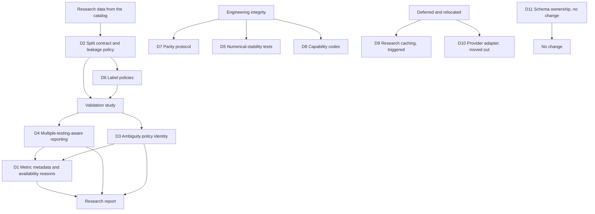

# VectorBT capability review: research-integrity mechanisms

Companion to [`vectorbt_lessons_implementation.md`](vectorbt_lessons_implementation.md) and to the
earlier [`vnpy_lessons_design.md`](vnpy_lessons_design.md). Throughout, the library is called
vectorbt; the community edition is distinguished from VectorBT PRO wherever the difference matters.

**Primary invariant.** vectorbt contributes mechanisms to the research and analysis layers of this
architecture; it does not dictate the architecture of those layers, and no vectorbt code may enter
this repository (section 1.2). Every item below is stated as a gap in NautilusTrader that vectorbt
either exposes or closes, never as a port of a vectorbt subsystem.

**Status.** Design review, revised after review feedback. No production code changes accompany this
document, because the authorising instruction permits code changes only for defects and none were
found (section 5.1 of the companion document). Items accepted here are specified, ordered and given
minimum acceptance criteria, and are marked **not implemented**.

### Revision summary

| Change                                         | Detail                                                                                                                                                                                     |
| ---------------------------------------------- | ------------------------------------------------------------------------------------------------------------------------------------------------------------------------------------------ |
| Decision set renumbered and reclassified       | Each decision now carries a layer: research integrity, engineering policy, deferred, or no change. The engineering decisions are no longer presented as research capabilities (section 12) |
| Study identity added as a first-class concept  | A research result is reproducible from the identity of the study that produced it, not only from its code path (section 7.6)                                                               |
| D4 rescoped                                    | The requirement is multiple-testing-aware reporting with trial provenance; the deflated Sharpe ratio is the first statistic that satisfies it, not the requirement itself                  |
| D2 rescoped                                    | The purge and embargo concept is mandatory and its values are not; a zero interval is allowed when justified and the justification is recorded                                             |
| D3 rescoped                                    | The ambiguity resolution is a versioned policy with an identity, and the identity is what the result records                                                                               |
| D1 extended                                    | Metrics gain a direction, so reporting and optimization do not have to infer it from a name                                                                                                |
| D6 scoped to a first tranche                   | Forward return, future aggregates, a first-hit threshold label and the wait convention come first; extrema and trend-state labels follow the dataset contract                              |
| D9 deferred                                    | Caching is a triggered capability with an identity model, not a Phase 1 deliverable                                                                                                        |
| D10 moved out                                  | The provider adapter contract belongs to the data-provider architecture, not to this document                                                                                              |
| Dependency graph and phases replaced           | The graph now shows information flow, the phases show work order, and the two are explicitly distinguished (sections 10 and 11)                                                            |
| Preconditions stated                           | The research-layer placement questions are a gate on this design rather than an open question inside it (section 1.3)                                                                      |
| Licence wording and provenance chain tightened | The rule is stated as an engineering boundary including a provenance chain, and the licensing consequences are left to a licensing review (section 7.3)                                    |

## 1. Purpose and scope

vectorbt is a mature vectorized research and backtesting library with a substantial research and
validation surface. Version 1.1.1 is not the library it was in 2020: it now carries a Rust engine
beside its Numba kernels, dispatches between them at call time, and ships a test suite larger than
its library code. It is therefore relevant to this project twice over, as a source of research-layer
mechanisms and as a worked example of governing two implementations of the same numerics.

The question this review asks is: **which research-integrity and validation mechanisms should this
project acquire, given what vectorbt implements and what this project already is.**

### 1.1 No market-specific semantics

This review introduces no market-specific semantics. Every accepted item is a statistical,
validation, engineering or process mechanism, and none of them touches a market rule. Where an item
would have touched one, it was removed: the data-provider contract was moved out of this document
(section 12, D10) precisely because provider integration is a data-architecture concern in which the
market question does arise. Market-rule concerns remain owned by the instrument, calendar, venue and
data layers.

### 1.2 The licence and provenance boundary

NautilusTrader is licensed **LGPL-3.0-only**. vectorbt is licensed **Apache-2.0 with Commons
Clause**, which the project describes as "Fair Code", and the GitHub API reports its SPDX identifier
as `NOASSERTION`.

The engineering rule, stated as a boundary rather than as a legal opinion: **no vectorbt source code,
dependency, copied documentation, test fixture, or mechanically derived implementation may enter this
repository.** Mechanisms must be independently specified from our own requirements and independently
implemented. Whether any particular use of the licence is permissible is a question for a licensing
review, not for a design document, and this document does not attempt to answer it.

Independence is maintained by a provenance chain, and an adopted mechanism must be able to show every
link of it:

```text
source observation
      |
independent requirement stated in our own terms
      |
independent interface and design
      |
independent implementation
      |
independent tests
```

### 1.3 Preconditions

This document assumes three placement decisions that are larger than any item in it, and that are
owned elsewhere. If any of them is answered differently, this document changes rather than the
answer:

1. **The research layer belongs in this repository.** Otherwise most items below have no home.
2. **The research layer may depend on the data catalog.** It reads catalog data and emits derived
   data; it does not own storage.
3. **The research layer cannot reach live execution.** It is not on the strategy path, and no live
   component may import it.

These are recorded here as a gate, not as an open question in section 13.

## 2. Method and evidence

The review was performed against source at a pinned revision, not against documentation.

| Source           | Revision                                                  | Size                                                                        |
| ---------------- | --------------------------------------------------------- | --------------------------------------------------------------------------- |
| `vectorbt`       | `ceffc501f2d37033a79dd86a9f883e69ec6977bd`, version 1.1.1 | 118 Python files, 105,199 lines including tests; 8 Rust files               |
| `vectorbt` tests | same revision                                             | 16 files, 36,259 lines (`test_portfolio.py` 10,831, `test_engine.py` 2,543) |
| `vectorbt-rust`  | crate version 1.1.1, same revision                        | pyo3 0.29, numpy 0.29, ndarray 0.17, rand 0.10                              |

External metadata came from the GitHub REST API: 9,242 stars, 1,183 forks, created 2017-11-14, last
push 2026-09-26; releases v1.1.1 (2026-09-26), v1.1.0 (2026-07-05), v1.0.0 (2026-04-22, which
introduced the Rust engine), v0.28.5, v0.28.4. The clone was a shallow checkout of `master` and was
removed after the record was written.

Claims in the companion document are cited by path and line against that revision. Claims about this
repository were verified against the working tree at code revision `d71348e30a`; the commits after it
in this branch are documentation only, so the code citations remain current. Coverage of the review
was:

- read in full: `vectorbt/generic/splitters.py`, `vectorbt/_engine.py`, `rust/README.md`, `LICENSE.md`, `pyproject.toml`, the getting-started pages, and the structure of `tests/test_engine.py`;
- read in part, by mechanism: the portfolio simulation kernels and their parameter surface, the
  signal and indicator factories, the statistics builder, the returns and drawdown analytics, the
  labels module, the data container and updater, and the configuration and caching utilities;
- not reviewed: `vectorbt/plotting` and the notebooks, `apps/`, `benchmarks/`, and VectorBT PRO,
  which is closed source and paid.

## 3. What vectorbt is mechanically

The architecture explains which of its mechanisms transfer and which do not.

- **A matrix engine, not an event engine.** The unit of work is a two-dimensional array: rows are
  time, columns are an instrument or a parameter combination. There is no clock, no queue, no venue
  and no live path. A backtest is a compiled kernel over arrays, and a parameter sweep is achieved by
  widening the array.
- **A portfolio simulator with a documented fill model.** `Portfolio.from_orders` and
  `Portfolio.from_signals` accept market-microstructure knobs as broadcast arguments and stop
  machinery as first-class parameters, including the reference price used to initialise a stop and
  the price used when a stop fires.
- **Records as structured arrays, with rich views on top.** Orders, logs, trades, positions,
  drawdowns and ranges are NumPy structured arrays with declared dtypes, and the analytic objects are
  views that derive their quantities from the record columns.
- **Accessors as the public surface.** Behaviour is attached to pandas and NumPy objects as
  accessors, which is what makes the library feel like pandas-native tooling rather than a framework.
- **Factories as the extension point.** Indicators, signals and labels are produced by a shared
  factory that turns a declaration into a class whose `.run(...)` performs the broadcast, the
  parameter grid, the concatenation and the column labelling.
- **Two implementations of the same numerics.** Since v1.0.0 every hot kernel has a Numba twin
  (`*_nb`) and a Rust twin (`*_rs`), with a resolver that decides per call which one runs.

The last point is a process contribution rather than a feature contribution: vectorbt is the inverse
of this project, and in inverting it, it documents the rules that make two implementations
survivable.

## 4. Capability taxonomy

The taxonomy is used to decide both provenance and layer classification.

| Area                                 | What vectorbt has                                                                                                                                            | Where it sits                                               | Layer        |
| ------------------------------------ | ------------------------------------------------------------------------------------------------------------------------------------------------------------ | ----------------------------------------------------------- | ------------ |
| A Execution and portfolio simulation | Signal and order simulation, stops, sizing, fees, slippage, cash, grouping, conflict policies                                                                | A research approximation of what this project does for real | Not adopted  |
| B Signal and indicator generation    | A declaration factory, parameter grids, ranking and index statistics, TA-Lib and pandas-ta adapters                                                          | Research ergonomics                                         | Not adopted  |
| C Statistics and analytics           | A declarative metric registry, preset statistics per object, rolling twins, drawdown records, empyrical-derived return metrics, a deflated Sharpe ratio      | Research and analysis                                       | D1, D4       |
| D Validation and optimization        | Three splitter classes over a generator contract, parameter grids, an advertised purged cross-validation in the paid edition only, no optimizer              | Research integrity                                          | D2           |
| E Data ingestion and storage         | A `Data` container contract, provider subclasses, a scheduler-driven updater, no on-disk cache in the community edition                                      | Data architecture, moved out                                | D10          |
| F Configuration and serialization    | A nested dict-like `Config`, a bespoke pickle layer, a global settings tree                                                                                  | Engineering, weaker than ours                               | Warning only |
| G Engineering process                | A dual-engine resolver, a documented kernel-addition process, parity and fallback tests, a published benchmark harness, test volume exceeding library volume | Engineering policy                                          | D5, D7, D8   |
| H Presentation                       | Plotly figures, widgets, dashboards, image helpers                                                                                                           | Out of scope by construction                                | Not adopted  |

The distinction between the two layers matters for the rest of this document. A **research-integrity**
mechanism changes what a reported research result means. An **engineering-policy** mechanism changes
how the code that produces it is written. They are adopted for different reasons, they are owned by
different work, and they are phased separately.

## 5. Where NautilusTrader stands

Verified against the working tree; the row-level evidence is in section 3 of the companion record.

| Capability                                                   | This project                                                                                     | vectorbt                                                                     |
| ------------------------------------------------------------ | ------------------------------------------------------------------------------------------------ | ---------------------------------------------------------------------------- |
| Multiple implementations of one kernel                       | None; the compiled extension is mandatory and owns the hot paths                                 | Numba and Rust twins with a runtime resolver                                 |
| Documented protocol for adding a second kernel               | Absent                                                                                           | Six-step process in `rust/README.md`                                         |
| Version compatibility between the two halves                 | Asserted at build time from the Python version prefix                                            | Checked at run time on the major/minor prefix                                |
| Capability probing with a machine-readable reason            | Present for order denial (`OrderDeniedReason` and a code enum)                                   | Present for engine support, with a free-text reason                          |
| Statistics registry                                          | Present: a `PortfolioStatistic` trait, a name-keyed map, 34 statistics, 20 registered by default | Present: a declarative metric config per class                               |
| Metric presentation metadata (title, units, tags, direction) | Absent; parameters are baked into the display name                                               | Present, except direction                                                    |
| Reason reported when a statistic cannot be computed          | Absent; the calculation returns `None` and the metric is dropped                                 | A warning is emitted with the reason                                         |
| Rolling twins of statistics                                  | Absent in the analysis crate                                                                     | Every return metric has a rolling twin                                       |
| Walk-forward windows                                         | Present as explicit optimization stages                                                          | Present as splitter classes                                                  |
| Reusable split contract, any length and any number of sets   | Absent                                                                                           | Present: three splitters over one generator contract                         |
| Purging and embargo                                          | Absent                                                                                           | Absent in the community edition; advertised in the paid edition              |
| Trial provenance for a research result                       | Present in part: a canonical digest and a run record exist; a study identity does not            | Absent                                                                       |
| Multiple-testing correction                                  | Absent                                                                                           | A deflated Sharpe ratio                                                      |
| Supervised labels                                            | Absent; proposed only in the earlier design document                                             | Five label policies plus four future-aggregate primitives                    |
| Bar-level ambiguity policy                                   | Documented and configurable, but the policy has no identity in the result                        | Pessimistic resolution, with ambiguous settings rejected                     |
| Numeric-stability test category                              | Goldens pinned; adversarial inputs not targeted                                                  | Targeted: three stability defects and one bounds defect fixed in one release |
| Data container contract with provider subclasses             | Absent; the catalog is the abstraction                                                           | Present, with per-symbol argument dispatch                                   |
| Dataset coverage and gap reporting                           | Present and mature in the catalog                                                                | Absent; the updater only refreshes                                           |
| Typed configuration with all-errors validation               | Present                                                                                          | Dict-like, validated by assertion                                            |
| Persistence format                                           | Parquet catalog with consolidation and coverage                                                  | Whole-object pickle                                                          |
| On-disk caching of market data                               | Present                                                                                          | Absent in the community edition                                              |

Two rows invert the intuition that a mature library must be ahead. Storage and configuration are
better here, and the reason is structural: this project has a typed Rust core and a catalog, while
vectorbt is a library over pandas that must not own a database.

## 6. Comparison and the structural difference

vectorbt is a research instrument: it exists to evaluate many ideas quickly, and it optimises for
throughput of experiments. This project is an execution platform with a research surface: it exists
to run the same idea in simulation and in production, and it optimises for the identity of the two.

Three consequences follow, and they explain why the accepted list is short.

1. **Most of vectorbt is not applicable, and not because it is bad.** Broadcasting parameter grids,
   accessor-driven APIs, presentation-heavy notebook artifacts and factory-generated indicator
   classes are excellent for a notebook and wrong for a live engine. They are excluded in section 7.2.
2. **Where the two projects agree, the agreement is evidence.** Both reconstruct per-trade analytics
   from an order log rather than from live state, and vectorbt asserts that its three trade views
   agree in total PnL. That is the same discipline as the accounting authority here, and the earlier
   review recorded it as a canonical-accounting decision. The overlap is treated as confirmation, not
   as a new item.
3. **Where vectorbt is silent, the silence is informative.** It has no queue position, no intrabar
   path, no depth, no partial fill against real liquidity, and no multiple-testing machinery beyond
   one ratio. A research layer built on the vectorbt model cannot claim live fidelity, which is why
   none of the simulation machinery is adopted here.

## 7. Architectural invariants

### 7.1 State ownership

| State                                    | Owner                                                                    |
| ---------------------------------------- | ------------------------------------------------------------------------ |
| Live execution, order and position state | The engine and the portfolio (unchanged)                                 |
| Bar, tick and instrument data            | The data catalog (unchanged)                                             |
| Derived research arrays                  | The research layer, as a pure function of catalog data                   |
| Metric definitions                       | The analysis layer, as registry entries                                  |
| Split membership                         | Computed per study from the split contract, never persisted as the truth |
| Study identity and its digests           | The research layer, recorded with every result                           |

A research component may read catalog data and emit derived data. It may not hold position state, may
not be reachable from the live path, and may not become a second accounting authority.

### 7.2 Mechanisms that must not enter

- **A runtime engine switch.** Bound at build time, not chosen at call time (D7).
- **Broadcast parameter grids as a core abstraction.** A parameter sweep is an optimization concern,
  already expressed by the parameter space and the search strategy.
- **Attribute magic on analysis objects.** No `__getattr__`-driven metric access; a metric is a
  registry entry or a method.
- **Pickle as the persistence protocol for configuration.** Typed configuration with serde
  round-trips already exists.
- **Look-ahead values reachable from the live path.** Labels are quarantined to the research path (D6).
- **Presentation artifacts inside the analysis crates.**
- **Any vectorbt code, dependency, copied text or fixture** (section 1.2).

### 7.3 Licence and provenance

NautilusTrader is LGPL-3.0-only; vectorbt is Apache-2.0 with Commons Clause and is reported by the
GitHub API as `NOASSERTION`. Therefore no source file, code fragment, docstring, table, test case or
data file from vectorbt may be copied, vendored, transliterated or mechanically paraphrased into this
repository, and no dependency on the package may be introduced. Mechanisms in this document are
described in prose, re-derived from the requirement they serve, and attributed to the source that
exposed them. The provenance chain in section 1.2 is the test: if a link cannot be shown, the
mechanism is not adopted.

### 7.4 Verification invariants

- **Independent views must agree.** Where the same fact can be derived more than once, the
  derivations are compared. vectorbt asserts that entry-trade, exit-trade and position views of the
  same order log agree in total PnL. This project has the same obligation through the accounting
  authority and the parent/child conservation invariant recorded in the earlier review, and any new
  research analytic is subject to it.
- **Every ambiguity is resolved explicitly, pessimistically and by an identified policy.** When the
  data cannot determine an outcome, the resolution is documented, defaults to the less favourable
  outcome, and is recorded in the result by policy identity (D3).

### 7.5 Report integrity

- A statistic that cannot be computed is reported as unavailable with a reason, never as zero and
  never as silence (D1).
- A research result that reports a performance figure must record how many trials produced it and
  what the trials were over, so a multiple-testing correction can be applied later even if it is not
  applied now (D4).
- A simulated fill assumption must appear in the result metadata, not only in the source (D3).

### 7.6 Study identity

**A research result must be reproducible from its study identity, its dataset identity, its
validation contract, its computation identity, its parameter identity and its assumption policy.**

This is the invariant that ties the rest of the document together, and it is the reason several
decisions below are stated as contracts on the result rather than as features. A result that cannot
name the study that produced it, the data it read, the code and kernels that computed it, the
parameters it swept and the assumptions it made is not a research result; it is an observation that
cannot be audited, compared or reproduced.

A study identity carries at least:

```text
ResearchStudy
    study_id
    dataset_digest
    split_contract
    label_definition
    feature_definition
    parameter_space
    objective
    trial_count
    validation_policy
    ambiguity_policy_id
    metric_set
    random_seed
    result_digest
```

and a result carries its implementation identity beside it:

```text
ResearchResult
    study_id
    dataset_digest
    code_version
    schema_version
    kernel_version
    numerical_backend
    parameter_digest
    result_digest
```

The implementation identity is not decoration. A research result computed before and after a numerical
change in a kernel is not the same result, and without a kernel identity the difference is invisible
until someone reruns it and cannot explain the drift.

## 8. Candidate learnings

Provenance is recorded per item: **`vectorbt`** means vectorbt supplies the mechanism; **`vectorbt,
extended`** means the shape is adopted and the implementation rejected or widened; **`Comparison`**
means the requirement was exposed by the comparison and vectorbt does not close it; **`Existing
architecture, confirmed`** means the pattern is already ours and vectorbt merely agrees with it.

### L1 Metric identity is not metric presentation

vectorbt declares each statistic as data: a title for humans, a calculation resolved by name or
callable, an optional post-processing step, an aggregation function, tags, and filters that decide
whether the metric applies at all. Identity and title are separate, so a metric can be renamed or
translated without touching its calculation. The registry is per class and copied per instance.

This project registers statistics by name in a map and computes them through a trait whose entry
points return `Option`. Three weaknesses follow. Display names carry their parameters, so identity and
presentation are fused. There is no units, tags or direction metadata. And a statistic that cannot be
computed returns `None` and disappears from the result, so unavailable and unregistered are
indistinguishable.

The shape to aim for is a definition and a result:

```text
MetricDefinition
    id
    title
    units
    tags
    direction        higher_is_better | lower_is_better | target | informational
    applicability

MetricResult
    value
    status           computed | unavailable | not_registered
    reason_code
    metadata
```

so that a metric can say `SharpeRatio, unavailable, insufficient_periods` instead of vanishing.

**Decision D1: adopt metric metadata and mandatory availability reasons. Provenance: `vectorbt,
extended`.** Identity is stable and machine-facing; title, units, tags and direction are declarative.
Direction exists so that reporting and optimization read it from the definition rather than inferring
it from a name, without putting optimization logic inside the metric. Rejected: string-path
calculation resolution, lambda post-processing, and warning-in-a-log as the reporting channel.

### L2 A split is a contract, and leakage is a policy

vectorbt expresses walk-forward validation as a generator contract: a splitter yields, per split, a
tuple of index arrays, one per set. Set lengths may be fractions or absolute counts; the variable set
is the last one, or the first when the direction is reversed; a minimum length filters windows; a
requested number of splits is selected evenly across the available windows rather than from the start;
an empty set and an oversized request are errors. Three splitters differ only in how they generate
the window bounds.

This project already has walk-forward windows and stages that search in-sample and evaluate
out-of-sample, but the window generator is welded to the stage, there is no reusable split contract,
and there is no purge or embargo anywhere in the repository. vectorbt is silent on leakage in its
community edition, which advertises purged cross-validation only as a paid feature. Both projects
share the same hole, and the comparison is what makes it visible.

The shape is a contract that carries its leakage policy:

```text
SplitContract
    train | validation | test

LeakagePolicy
    purge:   duration | none
    embargo: duration | none
```

**Decision D2: adopt a reusable split contract with an explicit leakage policy. Provenance:
`vectorbt, extended`.** The *concept* is mandatory: a splitter without any notion of leakage is the
defect being corrected. The *values* are not: a zero purge and a zero embargo are legitimate for a
study with no label overlap, provided the study records why the interval is zero. A reusable split is
a lazily generated sequence of tuples of index arrays with declared set lengths, a direction, a
minimum length and a leakage policy. The existing optimization stages consume the contract instead of
owning window generation.

### L3 Ambiguity resolution is a versioned policy, not an adjective

vectorbt cannot know the intrabar path from bars, and says so: the trailing stop may only be seeded
from a previous bar's extreme, the stop-loss is assumed to be hit before the take-profit when both
could have been hit, a gap through the threshold fills at the open rather than at the threshold, a
threshold outside the bar's range does not trigger, a stop has priority over a user signal on the
same bar, and a configuration with zero wait on both sides is rejected as ambiguous.

This project documents a bar ordering policy: bars are processed in a fixed order, or, when the
adaptive setting is enabled, the high or low closer to the open is visited first. That is a resolution
policy too, and it is stated, which is the important half. It is not pessimistic, and, more
importantly for reproducibility, it has no identity: a result cannot say which policy produced it.

```text
AmbiguityPolicy
    policy_id
    trigger_precedence
    intrabar_ordering
    gap_handling
    simultaneous_event_handling
    version
```

**Decision D3: define an explicit, versioned ambiguity policy and record its identity in the result.
Provenance: `Comparison`.** Every bar-derived fill assumption is documented where a consumer can see
it, not only in the source; the default is pessimistic; an ambiguity whose meaning depends on an
unspecifiable ordering is a configuration error rather than a silent convention; and a result records
the policy identity rather than the word "pessimistic", so a policy change does not silently rewrite
history. vectorbt's rules are not adopted as our fill rules: they belong to a bar simulator whose
model is not ours. Whether the existing default changes is an owner decision, because it changes
published numbers (section 13).

### L4 Multiple testing needs trial provenance, not one statistic

vectorbt computes a deflated Sharpe ratio and the expected maximum Sharpe under the null, from the
estimated per-period Sharpe ratio, the variance of the Sharpe ratio across trials, the number of
trials, the backtest horizon, the skew and the non-excess kurtosis. It is deliberately not part of the
default metric registry and is kept outside the compiled kernels.

This project's optimization layer enumerates experiments, runs them, ranks the results and reports
failures, and it computes no multiple-testing adjustment of any kind. The architecture requirement is
not "compute a deflated Sharpe ratio". It is: **every optimization study must preserve the number and
the provenance of its trials, so that multiple-testing corrections can be applied.**

Trial count alone is not enough, because a count is meaningless without the space it was drawn from.
The study records at least:

```text
study_id
dataset_digest
search_space_digest
parameter_count
trial_count
failed_trial_count
validation_scheme_digest
objective_definition
selection_rule
seed
```

**Decision D4: adopt multiple-testing-aware research reporting, with the deflated Sharpe ratio as the
initial statistic. Provenance: `vectorbt, extended`.** The requirement is the trial provenance above
and a reported correction; the deflated Sharpe ratio is one available correction, not the definition
of the requirement, and further diagnostics such as an overfitting probability can be added later
without changing the contract. The metric is per-period only, never annualised; missing returns are
excluded rather than zero-filled; the convention is non-excess kurtosis; and the mathematical
definition is pinned in our own terms rather than taken from any release of another project. The value
is reported, never a gate: a metric that gates is a risk rule and belongs with the risk caps.

### L5 Numeric stability is its own test category

The v1.1.1 release is the evidence: a rolling standard deviation that was not stable enough to be
trusted, a metric that used excess kurtosis where non-excess is required, expanding reductions whose
behaviour differed from the other engine when the minimum period exceeded the length, and an
out-of-bounds read on empty input. Four defects in one release, all in edge cases or accumulated float
error.

The standard is therefore not parity:

```text
parity tests
  + mathematical property tests
  + adversarial numerical tests
```

**Decision D5: adopt a numerical-stability test category for research kernels. Provenance:
`vectorbt`.** This is a numerical-correctness mechanism and is deliberately separate from the
engineering parity protocol (D7): D7 governs how two implementations are written and compared, D5
governs whether a single implementation is right at the edges. Adopted cases: running-variance and
running-mean stability over a long series against a compensated or two-pass computation; empty,
single-element and shorter-than-window inputs; a minimum period greater than the length, which must
yield NaN rather than a partial aggregate; NaN propagation and NaN parity; overflow and underflow;
very large and very small magnitudes; catastrophic cancellation; monotonicity where it is
mathematically required; invariance under constant translation and scaling where applicable; integer
and float layouts; and a documented divisor convention. Parity alone is not the standard, because two
implementations can agree and both be wrong.

### L6 Labels are a bounded policy set, quarantined from features

vectorbt ships nine label generators on the same factory as indicators: fixed-horizon forward return,
future-average return, and, more interestingly, a threshold-based local-extrema state machine with
per-element thresholds, five trend-encoding modes over the interval between two extrema, and a
first-hit breakout label that scans a forward window and reports which of two asymmetric thresholds
was breached first, the closest thing in either project to a triple-barrier label. Future aggregates
are computed by reversing the series, applying a rolling or exponentially weighted reduction,
reversing back and shifting, with a wait offset that excludes the current bar.

The earlier review already proposed a Feature, Label and Dataset layer with no implementation. This
item does not compete with it; it supplies the label policies that candidate was missing.

**Decision D6: adopt a label and target policy framework, in tranches. Provenance: `vectorbt,
extended`.** The first tranche is the fixed-horizon forward return, the future aggregates over a
forward window, a first-hit threshold label with asymmetric thresholds, the explicit wait convention,
and dataset-level leakage validation. Extrema and trend-state labels follow only once the dataset and
leakage contracts exist, because the contract and its leakage guarantee matter more than the number of
label types. Adopted in shape: the labels themselves and the wait. Rejected: reachability from the
feature path, since every one of these constructions is look-ahead by design and must be quarantined
to the target path; and parameter sweeps as a substitute for a dataset contract.

### L7 Two implementations of one kernel need a written protocol

vectorbt's Rust README specifies the whole process: treat the reference implementation as the
reference; mirror its argument order and return shape; register the binding and wire the dispatch; add
parity, fallback, explicit-error and memory-layout tests; add benchmarks only once parity is stable;
keep changes narrow and mechanical; never import the compiled module from the canonical
implementation; never make public callers import it either.

**Decision D7: adopt the parity protocol as engineering policy. Provenance: `vectorbt`.** This is an
engineering mechanism, not a research capability: it changes how a second implementation is written,
not what a result means. It is policy now and implementation only when a second implementation exists.
Adopted: the protocol, the test categories, and the rule that the canonical implementation never
imports the secondary one. Rejected: the runtime engine switch, because a call-time choice that
silently changes numerics makes every published result ambiguous, and this project already binds the
two halves at build time by asserting the Python version prefix.

### L8 Capability probing returns a code, not a sentence

vectorbt decides engine support with a frozen value object carrying `supported`, a human-readable
`reason` and a list of required array conversions. A forced engine that is unsupported raises rather
than degrading. The weakness is that the reason is prose, so a caller that needs to react has nothing
stable to match on.

This project already does the stronger thing for order denial: a typed reason enum renders a message
whose leading token is a stable `SCREAMING_SNAKE_CASE` code, a companion enum enumerates the closed
set, and the documented rule is that only the leading code is canonical.

**Decision D8: generalize the existing capability-code pattern. Provenance: `Existing architecture,
confirmed`.** The pattern is ours; vectorbt confirms that a capability answer is worth modelling
explicitly rather than returning a boolean. The decision is to extend it to analytics and data
availability queries: a capability answer is a value with a code from a closed set, a detail for
humans, and any required precondition or conversion. Prose is for humans, codes are for control flow,
and a boolean is never enough.

### L9 A cache needs an identity before it needs a policy

vectorbt gates caching with a ranked allow-and-deny policy, keeps the property descriptor so a cache
can be cleared per instance, attaches a per-instance LRU cache to methods, and bypasses caching when
an argument is unhashable instead of raising.

**Decision D9: defer declarative research caching to a triggered capability, with an identity model.
Provenance: `vectorbt`.** The requirement is not established today: there is no measured case of the
same expensive computation being repeated over the same dataset, configuration and parameters. The
cache key, if it is ever built, is an identity, not a function signature:

```text
CacheKey
    dataset_digest
    computation_id
    computation_version
    parameter_digest
    config_digest
```

because the worst research bug in this area is a cache that returns a result computed over different
data for the same arguments. Adopted in shape when triggered: declarative conditions, per-instance
override, disableable, degrading on unhashable arguments. Rejected: cache keys derived from a hash of
a value tuple, and invalidation that assumes the underlying object never changes.

### L10 A provider adapter is two methods, and the container owns the rest

vectorbt's data container requires a subclass to implement exactly two behaviours: fetch one symbol,
and update one symbol. Everything else is inherited: alignment across symbols, timezone conversion,
concatenation with duplicate-index removal, and per-symbol argument selection so one call can carry
heterogeneous arguments. A separate updater owns the periodic trigger, and the community edition has
no on-disk cache at all.

This project has the opposite shape: a mature catalog with consolidation, coverage and missing
interval reporting that vectorbt does not have, and no provider boundary.

**Decision D10: the provider adapter contract is moved out of this document. Provenance:
`vectorbt, extended`.** The mechanism is real, but it is a data-architecture decision rather than a
research-integrity one, and it is the only item in this review where a market question arises. It
belongs to the data-provider architecture review, where the catalog's existing coverage and gap
reporting is part of the same decision, and where the provider question can be answered without
dragging market semantics into a research document. Nothing in this document depends on it.

### L11 Schema ownership is a deliberate disagreement

vectorbt keeps the record dtype in Python and has Rust fill the memory of a buffer whose schema
Python defines at run time. This project does the reverse: the Rust core owns every domain schema,
Python receives generated stubs, and a test asserts ownership of every public class.

**Decision D11: keep our direction; record the disagreement. Provenance: `Comparison`.** One schema,
defined once, in the language that owns the invariants. Python-side dtype declaration would split the
schema across the boundary and make the stub generator a second source of truth.

## 9. Gaps vectorbt does not close

- **Live fidelity.** No queue position, no depth-aware partial fills, no intrabar path, no venue
  rules, no live path. Its simulation is a research approximation and cannot be a model for ours.
- **Purging and embargo mechanics.** Absent in the community edition and advertised only in the paid
  one, so the comparison supplied the requirement and not a rule.
- **Trial provenance.** vectorbt has a trial count in the deflated Sharpe ratio and no study identity
  around it.
- **Multiple testing beyond one ratio.** No overfitting probability, no combinatorial symmetric
  cross-validation, no bootstrap.
- **Persistence.** Whole-object pickle, no catalog, no coverage, no consolidation.
- **Configuration typing.** Validation by assertion over a nested dict, with documented cases where a
  reconstructed object silently loses arguments that came from global defaults.
- **Licence.** Even where a mechanism would have transferred verbatim, the Commons Clause forbids it.

## 10. Dependency graph

The graph shows information flow: what must exist for a result to be interpretable. It is not the work
order; the phases in section 11 are the work order.



D4 does not depend on D1. The correction needs per-period returns, Sharpe inputs and trial
provenance, all of which the study supplies; the metric contract in D1 makes the correction easier to
report, which is an integration and not a prerequisite. Where the graph shows D4 and D3 feeding D1,
the meaning is that the *report integration* consumes the metric contract, not that the contract waits
for them. That distinction is the reason the phases put D1 first: the contract is cheap and defines
the result shape, while the integration follows.

## 11. Recommended order

Phase 0 defines what a result means. Phase 1 tests whether it is trustworthy. Phase 2 extends the
research surface. Phase 3 sets engineering policy. Phase 4 is triggered work that should not start
without evidence.

### Phase 0: contracts

1. **D2, the split contract and its leakage policy.** First, because every out-of-sample number
   depends on it and because D6 and D4 both consume it.
2. **D1, metric identity and availability reasons.** The contract that defines the shape of a result.
3. **D3, the ambiguity policy and its identity.** Because a result that cannot name its assumptions
   cannot be compared with another result.

### Phase 1: integrity

4. **D4, multiple-testing-aware reporting.** The trial provenance record and the initial correction.
5. **D5, numerical-stability tests.** Beside D4, because both decide whether a reported figure may be
   believed.

### Phase 2: research surface

6. **D6, the first tranche of label policies.** Only after the dataset, split and leakage contracts
   exist, and only the tranche specified in L6.

### Phase 3: engineering policy

7. **D8, capability codes.** A generalization of an existing pattern, so it is cheap.
8. **D7, the parity protocol.** A document; implementation only if a second implementation appears.

### Phase 4: triggered infrastructure

9. **D9, declarative research caching.** Only when a measured case of repeated expensive computation
   exists over an identical dataset, configuration and parameter set.
10. **D10, the provider adapter.** Moved to the data-provider architecture review; scheduled there, not
    here.

### Not scheduled

D11, which records a decision to keep the current direction.

## 12. Decisions

Each decision carries its layer, because the layers are adopted for different reasons and phased
differently.

| ID  | Decision                                           | Layer                 | Provenance                       | Status                                                            |
| --- | -------------------------------------------------- | --------------------- | -------------------------------- | ----------------------------------------------------------------- |
| D1  | Metric identity, metadata and availability reasons | Research integrity    | vectorbt, extended               | Adopt                                                             |
| D2  | Reusable split contract with a leakage policy      | Research integrity    | vectorbt, extended               | Adopt; concept mandatory, values optional                         |
| D3  | Explicit ambiguity policy with result provenance   | Research integrity    | Comparison                       | Adopt                                                             |
| D4  | Multiple-testing-aware research reporting          | Research integrity    | vectorbt, extended               | Adopt; the deflated Sharpe ratio is the first statistic           |
| D5  | Numerical-stability testing                        | Numerical correctness | vectorbt                         | Adopt                                                             |
| D6  | Label and target policy framework                  | Research integrity    | vectorbt, extended               | Adopt in tranches; the first tranche is scoped                    |
| D7  | Secondary implementation parity protocol           | Engineering policy    | vectorbt                         | Adopt as policy; implement only if a second implementation exists |
| D8  | Capability-result codes                            | Engineering policy    | Existing architecture, confirmed | Generalize the existing pattern                                   |
| D9  | Declarative research caching                       | Deferred              | vectorbt                         | Deferred until a measured need; identity model specified          |
| D10 | Provider adapter                                   | Relocated             | vectorbt, extended               | Moved to the data-provider architecture review                    |
| D11 | Rust schema ownership                              | No change             | Comparison                       | Keep our direction; recorded disagreement                         |

### 12.1 Minimum acceptance per decision

The condition that makes a decision independently reviewable: the minimum that must be true before the
item may be called done.

| ID  | Minimum acceptance                                                                                                                                                                                                                                                                                                                              |
| --- | ----------------------------------------------------------------------------------------------------------------------------------------------------------------------------------------------------------------------------------------------------------------------------------------------------------------------------------------------- |
| D1  | Every registered statistic declares a title, units, tags and direction, and a result reports a status and a reason code for each statistic that could not be computed                                                                                                                                                                           |
| D2  | A split is produced by a contract that works for any series length, supports fractional and absolute set lengths, filters short windows and takes a leakage policy; a test asserts that no index appears in a test set and in its own in-sample set within the policy interval; a zero interval is permitted only with a recorded justification |
| D3  | Each bar-derived assumption is documented, the default is pessimistic, an ambiguous configuration is rejected, and a result records the ambiguity policy identity                                                                                                                                                                               |
| D4  | A study records the trial provenance listed in L4; the correction is computed from per-period inputs with the non-excess kurtosis convention pinned in our own terms; and the value is reported, never a gate                                                                                                                                   |
| D5  | The stability cases listed in L5 exist for each reducing research kernel, with running variance compared against an independent method rather than against the kernel's own twin                                                                                                                                                                |
| D6  | The first tranche exists only on the target path, a leakage test fails if a label value is read as a feature, and the first-hit label is pinned against a hand-computed asymmetric case                                                                                                                                                         |
| D7  | A written protocol exists and is linked from the crate that owns the boundary; the checklist applies only if a second implementation appears                                                                                                                                                                                                    |
| D8  | A probe returns a typed value with a code from a closed set, and a test asserts that no caller branches on the detail text                                                                                                                                                                                                                      |
| D9  | No acceptance criterion while deferred; if triggered, the cache key is the identity model in L9 and a cached and an uncached run agree exactly                                                                                                                                                                                                  |
| D10 | No acceptance criterion in this document; acceptance belongs to the data-provider architecture review                                                                                                                                                                                                                                           |
| D11 | No acceptance criterion: the decision is to change nothing                                                                                                                                                                                                                                                                                      |

## 13. Open questions

Ordered by what they gate. The placement questions are no longer here: they are preconditions
(section 1.3).

1. **Does the pessimistic bar default change existing published results?** If it does, it is an owner
   decision, not a review decision, and it needs a before-and-after comparison. This gates D3.
2. **What leakage interval is correct, and is it per set?** A purge before each test set and an
   embargo after it are the usual formulation, and the correct length depends on the label horizon and
   the bar spacing. This gates D2.
3. **What is the minimum trial count at which a correction says anything?** Below some number of
   trials the correction is noise on noise, and the metric should be reported as unavailable with a
   reason rather than computed. This gates D4 and depends on D1.
4. **Does a multiple-testing correction ever become a gate?** If it does, it is a risk rule and
   belongs with the risk caps, not with the analytics. The same question was left open by the earlier
   review.
5. **What is the units, tags and direction vocabulary, and is it closed?** A closed set is checkable;
   an open set is a spelling competition. This gates D1.
6. **Which other multiple-testing diagnostics are wanted beyond the first statistic?** An overfitting
   probability and a bootstrap are the obvious candidates, and the study record in L4 is what makes
   them possible later. This gates D4's second tranche.
7. **What is the minimum study identity that must be recorded before a result is comparable?** The
   field lists in section 7.6 are a proposal, and pruning them is easier than backfilling them once
   results exist.
