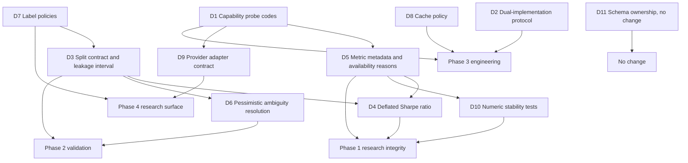

# VectorBT capability review: research-integrity mechanisms

Companion to [`vectorbt_lessons_implementation.md`](vectorbt_lessons_implementation.md) and to the
earlier [`vnpy_lessons_design.md`](vnpy_lessons_design.md). Throughout, the library is called
vectorbt; the community edition is distinguished from VectorBT PRO wherever the difference matters.

**Primary invariant.** vectorbt contributes mechanisms to the research and analysis layers of this
architecture; it does not dictate the architecture of those layers, and no vectorbt code may enter
this repository (section 7.3). Every item below is stated as a gap in NautilusTrader that vectorbt
either exposes or closes, never as a port of a vectorbt subsystem.

**Status.** Design review. No production code changes accompany this document, because the
authorising instruction permits code changes only for defects and none were found (section 5.1 of
the companion document). Items accepted here are specified, ordered and given minimum acceptance
criteria, and are marked **not implemented**.

## 1. Purpose and scope

vectorbt is the most widely used open source vectorised backtesting library, and version 1.1.1 is
not the library it was in 2020. It now carries a Rust engine beside its Numba kernels, dispatches
between them at call time, and ships a test suite larger than its library code. It is therefore
relevant to this project twice over: as a source of research-layer mechanisms, and as a worked
example of governing two implementations of the same numerics.

The question this review asks is: **which research-integrity and validation mechanisms should this
project acquire, given what vectorbt implements and what this project already is.**

### 1.1 The United States rule

United States market semantics are required wherever an item touches a market rule;
market-agnostic mechanisms are permitted; foreign-market-specific semantics are prohibited. This
review adopts no market rule at all: every accepted item is a statistical, validation or
process mechanism. The one place where the rule bites is the data-provider layer, where the
competing provider list is mostly non-United-States (section 8, D9), and the options, contract and
settlement machinery of the sibling products stays out of scope by construction.

### 1.2 The licence rule

NautilusTrader is licensed **LGPL-3.0-only**. vectorbt is licensed **Apache-2.0 with Commons
Clause**, described by its author as "Fair Code": the Commons Clause removes the right to sell the
software, a right that Apache-2.0 grants. That is a non-OSI licence, and the GitHub API reports its
SPDX identifier as `NOASSERTION`.

The consequence is absolute and is restated as invariant 7.3: **no vectorbt code, text, table or
data file may be copied, vendored, transliterated or paraphrased into this repository.** Every
mechanism below is described in prose, re-derived from the stated requirement, and attributed. This
review exists to raise the quality of our own design; a licence conflict would be a far larger
defect than any mechanism it might save us from writing.

## 2. Method and evidence

The review was performed against source at a pinned revision, not against documentation.

| Source           | Revision                                                  | Size                                                                        |
| ---------------- | --------------------------------------------------------- | --------------------------------------------------------------------------- |
| `vectorbt`       | `ceffc501f2d37033a79dd86a9f883e69ec6977bd`, version 1.1.1 | 118 Python files, 105,199 lines including tests; 8 Rust files               |
| `vectorbt` tests | same revision                                             | 16 files, 36,259 lines (`test_portfolio.py` 10,831, `test_engine.py` 2,543) |
| `vectorbt-rust`  | crate version 1.1.1, same revision                        | pyo3 0.29, numpy 0.29, ndarray 0.17, rand 0.10                              |

External metadata came from the GitHub REST API: 9,242 stars, 1,183 forks, created 2017-11-14,
last push 2026-09-26; releases v1.1.1 (2026-09-26), v1.1.0 (2026-07-05), v1.0.0 (2026-04-22,
which introduced the Rust engine), v0.28.5, v0.28.4. The clone was a shallow checkout of `master`
and was removed after the record was written.

Claims in the companion document are cited by path and line against that revision. Claims about
this repository were verified against the working tree at `d71348e30a`. Coverage of the review was:

- read in full: `vectorbt/generic/splitters.py`, `vectorbt/_engine.py`, `rust/README.md`, `LICENSE.md`, `pyproject.toml`, the getting-started pages, `tests/test_engine.py` (structure);
- read in part, by mechanism: the portfolio simulation kernels and their parameter surface, the
  signal and indicator factories, the statistics builder, the returns and drawdown analytics, the
  labels module, the data container and updater, the configuration and caching utilities;
- not reviewed: `vectorbt/plotting` and the notebooks, `apps/`, `benchmarks/`, and the VectorBT PRO
  edition, which is closed source and paid.

## 3. What vectorbt is mechanically

The architecture explains which of its mechanisms transfer and which do not.

- **A matrix engine, not an event engine.** The unit of work is a two-dimensional array: rows are
  time, columns are an instrument or a parameter combination. There is no clock, no queue, no venue
  and no live path. A backtest is a compiled kernel over arrays, and a parameter sweep is achieved
  by widening the array.
- **A portfolio simulator with a documented fill model.** `Portfolio.from_orders` and
  `Portfolio.from_signals` accept the market-microstructure knobs as broadcast arguments (sizing,
  fees, fixed fees, slippage, granularity, rejection probability, partial fills, cash locking) and
  the stop machinery as first-class parameters (`sl_stop`, `sl_trail`, `tp_stop`, the reference price
  for stop initialisation, the price used when a stop fires, and the conflict/update policies).
- **Records as structured arrays, with rich views on top.** Orders, logs, trades, positions,
  drawdowns and ranges are NumPy structured arrays with declared dtypes, and the analytic objects
  (`Orders`, `Trades`, `Positions`, `Drawdowns`) are views that derive their quantities from the
  record columns.
- **Accessors as the public surface.** Behaviour is attached to pandas and NumPy objects as
  accessors (`obj.vbt.returns.sharpe_ratio()`, `mask.vbt.signals.stats()`), which is what makes the
  library feel like panda-native tooling rather than a framework.
- **Factories as the extension point.** Indicators, signals and labels are produced by a shared
  factory that turns a declaration (input names, parameter names, output names, a compiled apply
  function, an optional cache function) into a class whose `.run(...)` performs the broadcast, the
  parameter grid, the concatenation and the column labelling.
- **Two implementations of the same numerics.** Since v1.0.0 every hot kernel has a Numba twin
  (`*_nb`) and a Rust twin (`*_rs`), with a resolver that decides per call which one runs.

The last point is the most interesting, and it is a *process* contribution rather than a feature
contribution: vectorbt is the inverse of this project, and in inverting it, it documents the rules
that make two implementations survivable.

## 4. Capability taxonomy

The taxonomy is used to decide provenance for each candidate learning.

| Area                                 | What vectorbt has                                                                                                                                                       | Where it sits                                                        |
| ------------------------------------ | ----------------------------------------------------------------------------------------------------------------------------------------------------------------------- | -------------------------------------------------------------------- |
| A Execution and portfolio simulation | Signal and order simulation, stops, sizing, fees, slippage, cash, grouping, conflict policies                                                                           | Research approximation of what this project does for real            |
| B Signal and indicator generation    | A declaration factory, parameter grids, ranking and index statistics, TA-Lib and pandas-ta adapters, custom indicator classes                                           | Research layer; no live equivalent needed                            |
| C Statistics and analytics           | A declarative metric registry, preset statistics per object, rolling twins of every metric, drawdown records, empyrical-derived return metrics, a deflated Sharpe ratio | Research and analysis layer; partly already present here             |
| D Validation and optimization        | Three walk-forward splitter classes over a generator contract, parameter grids, an advertised purged cross-validation in the paid edition only, no optimizer            | This is the area with the clearest gap here                          |
| E Data ingestion and storage         | A `Data` container contract, provider subclasses, a scheduler-driven updater, no on-disk cache in the community edition                                                 | Storage is stronger here; the provider boundary is the gap           |
| F Configuration and serialization    | A nested dict-like `Config` with frozen keys and a checkpoint, a bespoke pickle layer, a global settings tree                                                           | Weaker than the typed configuration here; useful mainly as a warning |
| G Engineering process                | A dual-engine resolver, a documented kernel-addition process, parity and fallback tests, a published benchmark harness, test volume exceeding library volume            | The most transferable area                                           |
| H Presentation                       | Plotly figures, widgets, dashboards, image and animation helpers                                                                                                        | Out of scope by construction                                         |

## 5. Where NautilusTrader stands

Verified against the working tree; the row-level evidence is in section 3 of the companion record.

| Capability                                               | This project                                                                                     | vectorbt                                                        |
| -------------------------------------------------------- | ------------------------------------------------------------------------------------------------ | --------------------------------------------------------------- |
| Multiple implementations of one kernel                   | None; the compiled extension is mandatory and owns the hot paths                                 | Numba and Rust twins with a runtime resolver                    |
| Documented protocol for adding a second kernel           | Absent                                                                                           | Six-step process in `rust/README.md`                            |
| Version compatibility between the two halves             | Asserted at build time from the Python version prefix                                            | Checked at run time on the major/minor prefix                   |
| Capability probing with a machine-readable reason        | Present for order denial (`OrderDeniedReason` plus a code enum)                                  | Present for engine support, with a free-text reason             |
| Statistics registry                                      | Present: a `PortfolioStatistic` trait, a name-keyed map, 34 statistics, 20 registered by default | Present: a declarative metric config per class                  |
| Metric presentation metadata (title, units, tags)        | Absent; parameters are baked into the display name                                               | Present                                                         |
| Reason reported when a statistic cannot be computed      | Absent; the calculation returns `None` and the metric is dropped                                 | A warning is emitted with the reason                            |
| Rolling twins of statistics                              | Absent in the analysis crate                                                                     | Every return metric has a rolling twin                          |
| Walk-forward windows                                     | Present as explicit optimization stages                                                          | Present as splitter classes                                     |
| Reusable split contract (any length, any number of sets) | Absent                                                                                           | Present: three splitters over one generator contract            |
| Purging and embargo                                      | Absent                                                                                           | Absent in the community edition; advertised in the paid edition |
| Multiple-testing correction                              | Absent                                                                                           | A deflated Sharpe ratio                                         |
| Supervised labels                                        | Absent; proposed only in the earlier design document                                             | Five label policies plus four future-aggregate primitives       |
| Bar-level ambiguity policy                               | A documented ordering policy, adaptive or fixed, configurable                                    | Pessimistic resolution, with ambiguous settings rejected        |
| Numeric-stability test category                          | Goldens pinned; adversarial inputs not targeted                                                  | Targeted: three stability defects fixed in one release          |
| Data container contract with provider subclasses         | Absent; the catalog is the abstraction                                                           | Present, with per-symbol argument dispatch                      |
| Dataset coverage and gap reporting                       | Present and mature in the catalog                                                                | Absent; the updater only refreshes                              |
| Typed configuration with all-errors validation           | Present                                                                                          | Dict-like, validated by assertion                               |
| Persistence format                                       | Parquet catalog with consolidation and coverage                                                  | Whole-object pickle                                             |
| On-disk caching of market data                           | Present                                                                                          | Absent in the community edition                                 |

Two rows deserve emphasis because they invert the intuition that a mature library must be ahead.
Storage and configuration are better here, and the reason is structural: this project has a typed
Rust core and a catalog, while vectorbt is a library over pandas that must not own a database.

## 6. Comparison and the structural difference

vectorbt is a research instrument: it exists to evaluate many ideas quickly, and it optimises for
throughput of experiments. This project is an execution platform with a research surface: it exists
to run the same idea in simulation and in production, and it optimises for the identity of the two.

Three consequences follow, and they explain why the accepted list below is short.

1. **Most of vectorbt is not applicable, and not because it is bad.** Broadcasting parameter grids,
   accessor-driven APIs, health-free HTML artefacts and factory-generated indicator classes are
   excellent for a notebook and wrong for a live engine. They are excluded in section 7.2.
2. **Where the two projects agree, the agreement is evidence.** Both reconstruct per-trade
   analytics from an order log rather than from live state, and vectorbt asserts that its three
   trade views agree in total PnL. That is the same discipline as the accounting authority here, and
   the earlier review recorded it as a canonical-accounting decision. The overlap is treated as
   confirmation, not as a new item.
3. **Where vectorbt is silent, the silence is informative.** It has no queue position, no intrabar
   path, no depth, no partial fill against real liquidity, and no multiple-testing machinery beyond
   one ratio. A research layer built on the vectorbt model cannot claim live fidelity, which is why
   none of the simulation machinery is adopted here.

## 7. Architectural invariants

### 7.1 State ownership

| State                                    | Owner                                                                  |
| ---------------------------------------- | ---------------------------------------------------------------------- |
| Live execution, order and position state | The engine and the portfolio (unchanged)                               |
| Bar, tick and instrument data            | The data catalog (unchanged)                                           |
| Derived research arrays                  | The research layer, which is a pure function of catalog data           |
| Metric definitions                       | The analysis layer, as registry entries                                |
| Split membership                         | Computed per run from the split contract, never persisted as the truth |

A research component may read catalog data and emit derived data. It may not hold position state,
may not be reachable from the live path, and may not become a second accounting authority.

### 7.2 Mechanisms that must not enter

- **A runtime engine switch.** Bound at build time, not chosen at call time (D2).
- **Broadcast parameter grids as a core abstraction.** A parameter sweep is an optimization concern,
  already expressed by the parameter space and the search strategy.
- **Attribute magic on analysis objects.** No `__getattr__`-driven metric access; a metric is a
  registry entry or a method.
- **Pickle as the persistence protocol for configuration.** Typed configuration with serde
  round-trips already exists.
- **Look-ahead values reachable from the live path.** Labels are quarantined to the research path
  (D7).
- **Plotting, widgets and image artefacts inside the analysis crates.**
- **Any vectorbt code or text** (section 1.2 and invariant 7.3).

### 7.3 Licence and provenance

NautilusTrader is LGPL-3.0-only. vectorbt is Apache-2.0 with Commons Clause, a non-OSI licence.
Therefore: no source file, code fragment, docstring, table, test case or data file from vectorbt may
be copied, vendored, transliterated or mechanically paraphrased into this repository, and no
dependency on the package may be introduced. Mechanisms in this document are described in prose,
re-derived from the requirement they serve, and attributed to the source that exposed them. An
adopted mechanism must be justified by an independently stated requirement and must be testable
against our own data.

### 7.4 Verification invariants

- **Independent views must agree.** Where the same fact can be derived more than once, the
  derivations are compared. vectorbt asserts that entry-trade, exit-trade and position views of the
  same order log agree in total PnL. This project has the same obligation through the accounting
  authority and the parent/child conservation invariant recorded in the earlier review, and any new
  research analytic is subject to it.
- **Every ambiguity is resolved explicitly and pessimistically.** When the data cannot determine an
  outcome (the intrabar path during a bar-only backtest, the order of two simultaneous triggers),
  the resolution is documented, defaults to the less favourable outcome, and is recorded in the
  result. Silent optimistics are defects (D6).

### 7.5 Report integrity

- A statistic that cannot be computed is reported as unavailable with a reason, never as zero and
  never as silence (D5).
- A search result that reports a performance figure must record how many trials produced it, and a
  multiple-testing correction must be available wherever the trial count is known (D4).
- A simulated fill assumption must appear in the result metadata, not only in the source (D6).

## 8. Candidate learnings

Provenance is recorded per item: **`vectorbt`** means vectorbt supplies the mechanism; **`vectorbt,
extended`** means the shape is adopted and the implementation rejected or widened; **`Comparison`**
means the requirement was exposed by the comparison and vectorbt does not close it.

### L1 Capability probing returns a code, not a sentence

vectorbt decides engine support with a frozen value object carrying `supported`, a human-readable
`reason`, and a list of required array conversions, produced by predicate helpers and threaded into
a resolver. A forced engine that is unsupported raises rather than degrading. The weakness is that
the reason is prose, so callers that need to react have nothing stable to match on.

This project already does the stronger thing for order denial: a typed reason enum renders a message
whose leading token is a stable `SCREAMING_SNAKE_CASE` code, a strum-generated companion enum
enumerates the closed set, and the documented rule is that only the leading code is canonical and
consumers must not recover classification from the suffix.

**Decision D1: adopt the probe shape and extend the existing code discipline to analytics and data
availability. Provenance: `vectorbt, extended`.** A capability answer is a value with a code, a
detail, and any required conversion or precondition. Prose is for humans; codes are for control
flow; a boolean is never enough.

### L2 Two implementations of one kernel need a written protocol

vectorbt's Rust README specifies the whole process: treat the reference implementation as the
reference; mirror its argument order and return shape; register the binding and wire the dispatch;
add parity, fallback, explicit-error and memory-layout tests; add benchmarks only once parity is
stable; keep changes narrow and mechanical; never import the compiled module from the canonical
implementation; never make public callers import it either.

The same project also shows the cost. Its v1.1.1 release fixed the numerical stability of rolling
standard deviation in both engines, corrected the deflated Sharpe ratio to use non-excess kurtosis
and ignore missing returns (noting that results change), aligned expanding mean and standard
deviation across engines when the minimum period exceeds the number of rows, and fixed an out-of-bounds
read on empty input.

**Decision D2: adopt the protocol, reject the runtime switch. Provenance: `vectorbt`.** This project
keeps a mandatory extension and a Rust-owned schema, and it binds the two halves at build time by
asserting the Python version prefix; a call-time switch that silently changes numerics would make
every published result ambiguous. The protocol is adopted for any future second implementation,
including the version-to-version comparison harness that already exists outside the package.

### L3 A split is a contract, and leakage needs its own interval

vectorbt expresses walk-forward validation as a generator contract: a splitter yields, per split, a
tuple of index arrays, one per set. Set lengths may be fractions or absolute counts; the variable set
is the last one, or the first when the direction is reversed; a minimum length filters windows; a
requested number of splits is selected evenly across the available windows rather than from the
start; an empty set and an oversized request are errors. Three splitters (fixed range, rolling,
expanding) differ only in how they generate the window bounds.

This project already has walk-forward windows and stages that search in-sample and evaluate
out-of-sample, but the window generator is welded to the stage, there is no reusable split contract,
and there is no purge or embargo anywhere in the repository. vectorbt is silent on leakage in its
community edition, which advertises purged cross-validation only as a paid feature. Both projects
therefore share the same hole, and the comparison is what makes it visible.

**Decision D3: adopt a split contract with an explicit leakage interval. Provenance: `vectorbt,
extended`.** A reusable split is a lazily generated sequence of tuples of index arrays with declared
set lengths, a direction, a minimum length, and a leakage interval between sets. The interval is not
optional in the specification even though neither project implements it, because a walk-forward study
without a purge rule overstates its own out-of-sample quality.

### L4 Multiple-testing correction for search results

vectorbt computes a deflated Sharpe ratio and the expected maximum Sharpe under the null, from the
estimated per-period Sharpe, the variance of the Sharpe ratio across trials, the number of trials,
the backtest horizon, the skew and the non-excess kurtosis. It is deliberately not part of the
default metric registry and it is kept outside the compiled kernels.

This project's optimization layer enumerates experiments, runs them, ranks the results and reports
failures, and it computes no multiple-testing adjustment of any kind: no deflated ratio, no
probability of backtest overfitting, no bootstrap. It does know the trial count, because the report
contains every result and every failure.

**Decision D4: adopt the deflated Sharpe ratio in its corrected form, reported and never a gate.
Provenance: `vectorbt`.** The inputs are per-period, never annualised; the trial count and the
variance of the Sharpe ratio across trials come from the run; the metric is reported alongside the
run's trial count so a reader can see the correction. The pre-1.1.1 formulation is not adopted,
because a correction that is itself wrong is worse than no correction.

### L5 Metric identity is not metric presentation

vectorbt declares each statistic as data: a title for humans, a calculation resolved by name or
callable, an optional post-processing step, an aggregation function, tags, and filters that decide
whether the metric applies at all. Identity and title are separate, so a metric can be renamed or
translated without touching its calculation. The registry is per class and copied per instance, so
one object can add or override a metric without affecting others.

This project registers statistics by name in a map and computes them through a trait whose entry
points return `Option`. Three weaknesses follow. Display names carry their parameters, so
identity and presentation are fused. There is no units or tags metadata. And a statistic that cannot
be computed returns `None` and simply disappears from the result, so unavailable and unregistered
are indistinguishable.

**Decision D5: adopt metric metadata and mandatory availability reasons. Provenance: `vectorbt,
extended`.** A registered statistic declares its identity, title, units and tags, so the same
identity can be presented differently; and when a statistic is registered but cannot be computed
from the available inputs, the result records that fact together with a code naming the missing
input. Rejected: string-path calculation resolution, lambda post-processing, and warning-in-a-log as
the reporting channel.

### L6 Ambiguous intrabar outcomes are resolved pessimistically and in writing

vectorbt cannot know the intrabar path from bars, and says so: the trailing stop may only be seeded
from a previous bar's extreme, the stop-loss is assumed to be hit before the take-profit when both
could have been hit, a gap through the threshold fills at the open rather than at the threshold, a
threshold outside the bar's range does not trigger at all, a stop has priority over a user signal on
the same bar, and a configuration with zero wait on both sides is rejected as ambiguous.

This project documents a bar ordering policy: bars are processed in a fixed order, or, when the
adaptive setting is enabled, the high or low closer to the open is visited first. That is a
resolution policy too, and it is stated, which is the important half. It is not pessimistic: the
adaptive heuristic can be optimistic about which extreme came first.

**Decision D6: document the policy, default pessimistically, and record it in the result.
Provenance: `Comparison`.** Every bar-derived fill assumption is stated where a consumer can see it,
not only in the source; ambiguous configurations are rejected rather than resolved silently; and the
ordering policy that produced a result is recorded so two results are comparable. Whether the
existing default changes is an owner decision, because it changes published numbers (section 13).

### L7 Labels are a bounded research policy set, quarantined from features

vectorbt ships nine label generators built on the same factory as indicators: fixed-horizon forward
return, future-average return, and, more interestingly, a threshold-based local-extrema state
machine with per-element thresholds, five trend-encoding modes over the interval between two
extrema, and a first-hit breakout label that scans a forward window and reports which of two
asymmetric thresholds was breached first, which is the closest thing in either project to a
triple-barrier label. The future aggregates are computed by reversing the series, applying a rolling
or exponentially weighted reduction, reversing back and shifting, with a wait offset so the current
bar is excluded.

The earlier review already proposed a Feature, Label and Dataset layer as a candidate with no
implementation. This item does not compete with it: it supplies the concrete label policies that
candidate was missing.

**Decision D7: extend the existing Feature/Label/Dataset candidate with these label policies.
Provenance: `vectorbt, extended`.** Adopted in shape: the first-hit breakout with asymmetric
thresholds, per-element thresholds, the local-extrema state machine, the trend modes, and
future-aggregate primitives expressed with an explicit wait. Rejected: reachability from the feature
path, because every one of these constructions is look-ahead by design and must be quarantined to
the target path; and parameter sweeps as a substitute for a dataset contract.

### L8 A cache policy should be declarative and degrade, not raise

vectorbt gates caching with a ranked allow-and-deny policy: each condition names an instance, a
function, a class or flags, specificity decides precedence, and a global switch can disable
everything. The property decorator keeps its descriptor and stores the value on the instance, so a
cache can be cleared per instance; the method decorator attaches a per-instance LRU cache and
bypasses caching when an argument is unhashable instead of raising.

**Decision D8: adopt a declarative cache policy for the research layer, with degradation on
unhashable arguments. Provenance: `vectorbt`.** Adopted in shape; rejected: cache keys derived from
a hash of a tuple, and invalidation that assumes the underlying object never changes. The policy
exists so that an expensive research computation is cached once, visibly, and can be turned off.

### L9 A provider adapter is two methods, and the container owns the rest

vectorbt's data container requires a subclass to implement exactly two behaviours: fetch one symbol,
and update one symbol. Everything else is inherited: alignment across symbols, timezone conversion,
concatenation with duplicate-index removal, statistics, plotting and pickling. Updates return a new
container rather than mutating the old one, and per-symbol keyword selection lets one call carry
heterogeneous arguments. A separate updater owns the periodic trigger, and in the community edition
there is no on-disk cache at all: persistence is whole-object pickle.

This project has the opposite shape. The catalog is mature, with consolidation, coverage and missing
interval reporting that vectorbt does not have, and there is no provider boundary at all.

**Decision D9: adopt the provider adapter contract; reject the persistence model. Provenance:
`vectorbt, extended`.** An adapter fetches one instrument and updates one instrument; the catalog
owns storage, coverage and gaps. Rejected: pickle persistence, wall-clock scheduling as an engine
clock, and the provider list itself, which is mostly non-United-States; only a United-States provider
may be considered, and none is scheduled by this review.

### L10 Numeric stability is its own test category

The v1.1.1 release is the evidence: a rolling standard deviation that was not stable enough to be
trusted, a metric that used excess kurtosis where non-excess is required, expanding reductions whose
behaviour differed from the other engine when the minimum period exceeded the length, and an
out-of-bounds read on empty input. Four defects in one release, all of them in edge cases or
accumulated float error, and all of them in code with two implementations.

**Decision D10: adopt a numerical-stability test category for research kernels. Provenance:
`vectorbt`.** The category is: running-variance stability over a long series, empty and
single-element inputs, minimum period greater than length, NaN propagation and NaN parity,
integer and float layouts, and agreement between implementations on all of those. Parity alone is
not the standard, because two implementations can agree and both be wrong.

### L11 Schema ownership is a deliberate disagreement

vectorbt keeps the record dtype in Python and has Rust fill the memory of a buffer whose schema
Python defines at run time. This project does the reverse: the Rust core owns every domain schema,
Python receives generated stubs, and `test_public_module_names` asserts ownership of every public
class.

**Decision D11: keep our direction; record the disagreement. Provenance: `Comparison`.** One schema,
defined once, in the language that owns the invariants. Python-side dtype declaration would split the
schema across the boundary and make the stub generator a second source of truth.

## 9. Gaps vectorbt does not close

- **Live fidelity.** No queue position, no depth-aware partial fills, no intrabar path, no venue
  rules, no live path. Its simulation is a research approximation and cannot be a model for ours.
- **Purging and embargo.** Absent in the community edition and advertised only in the paid one, so
  the comparison could not supply a concrete rule; only the requirement.
- **Multiple testing beyond one ratio.** No probability of backtest overfitting, no combinatorial
  symmetric cross-validation, no bootstrap.
- **Persistence.** Whole-object pickle, no catalog, no coverage, no consolidation.
- **Configuration typing.** Validation by assertion over a nested dict, with documented cases where
  a reconstructed object silently loses arguments that came from global defaults.
- **Licence.** Even where a mechanism would have transferred verbatim, the Commons Clause forbids it.

## 10. Dependency graph

The graph encodes one real constraint and several conveniences. The real constraint is that a
multiple-testing correction (D4) is only meaningful once a statistic can say why it is unavailable
(D5) and once the trial count has a defined provenance, which the split contract (D3) supplies. The
conveniences are stated as such: no phase's acceptance criterion depends on another phase's
implementation.

## 11. Recommended order

Phased so that each phase's acceptance tests can exercise the phase before it, and ordered so that
the cheapest corrections to the honesty of a reported result come first.

### Phase 1: research integrity

1. **D5, metric metadata and availability reasons.** First, because a result that cannot say why a
   statistic is missing cannot be trusted, and because D4 needs it.
2. **D4, the deflated Sharpe ratio.** Second, because an optimization result that reports a score
   without its trial count overstates the evidence.
3. **D10, numeric stability tests.** Third, because these are cheap, adversarial, and the only
   category that catches the defects vectorbt actually shipped.

### Phase 2: validation

4. **D3, the split contract and its leakage interval.**
5. **D6, the ambiguity policy.** With D3, because both change what an out-of-sample number means.

### Phase 3: engineering

6. **D1, capability probe codes.**
7. **D2, the dual-implementation protocol.** A document, not code, unless a second implementation
   appears.
8. **D8, the cache policy.**

### Phase 4: research surface

9. **D7, label policies.** With the Feature/Label/Dataset candidate from the earlier review, not
   before it.
10. **D9, the provider adapter contract.**

### Not scheduled

D11, which records a decision to keep the current direction.

## 12. Decisions

| ID  | Mechanism            | Provenance         | Decision                                                                                   |
| --- | -------------------- | ------------------ | ------------------------------------------------------------------------------------------ |
| D1  | Capability probing   | vectorbt, extended | A capability answer carries a stable code and a detail, never a bare boolean or free text  |
| D2  | Two implementations  | vectorbt           | Adopt the parity protocol; reject the runtime engine switch                                |
| D3  | Validation splits    | vectorbt, extended | Adopt a reusable split contract with an explicit leakage interval                          |
| D4  | Multiple testing     | vectorbt           | Adopt the deflated Sharpe ratio in its corrected form, reported and never a gate           |
| D5  | Metric metadata      | vectorbt, extended | Separate identity from presentation; require a reason when a statistic is unavailable      |
| D6  | Ambiguity resolution | Comparison         | Document every bar-level fill assumption, default pessimistically, record it               |
| D7  | Labels               | vectorbt, extended | Extend the existing label candidate with these policies; keep them out of the feature path |
| D8  | Caching              | vectorbt           | Adopt a declarative cache policy that degrades on unhashable arguments                     |
| D9  | Data providers       | vectorbt, extended | Adopt a two-method adapter contract; reject the persistence model and the provider list    |
| D10 | Numeric stability    | vectorbt           | Adopt a stability test category beside parity                                              |
| D11 | Schema ownership     | Comparison         | No change: the Rust core keeps ownership of every schema                                   |

### 12.1 Minimum acceptance per decision

The condition that makes a decision independently reviewable, as before: the minimum that must be
true before the item may be called done.

| ID  | Minimum acceptance                                                                                                                                                                                                                                  |
| --- | --------------------------------------------------------------------------------------------------------------------------------------------------------------------------------------------------------------------------------------------------- |
| D1  | A probe returns a typed value with a code from a closed set, and a test asserts that no caller branches on the detail text                                                                                                                          |
| D2  | A written protocol exists and is linked from the crate that owns the boundary; if a second implementation ever appears, its acceptance includes parity, fallback, explicit-error and layout tests                                                   |
| D3  | A split is produced by a contract that works for any series length, supports fractional and absolute set lengths, filters short windows, and takes a leakage interval; a test asserts that no index appears in two sets within the leakage interval |
| D4  | The metric is computed from per-period inputs, its trial count is recorded with the result, and a hand-computed case pins the value                                                                                                                 |
| D5  | Every registered statistic declares a title, units and tags, and a result reports a code for each statistic that could not be computed                                                                                                              |
| D6  | Each bar-derived fill assumption is documented, defaults pessimistically, and the policy that produced a result is recoverable from the result                                                                                                      |
| D7  | Label policies exist only on the target path, a leakage test fails if a label value is read as a feature, and the first-hit breakout label is pinned against a hand-computed case                                                                   |
| D8  | The policy is declarative, per-instance overridable, disableable, and an unhashable argument produces an uncached result rather than an error                                                                                                       |
| D9  | An adapter implements fetch-one and update-one; storage, coverage and gap reporting remain the catalog's; no non-United-States provider is added                                                                                                    |
| D10 | Stability cases exist for long-series variance, empty and single-element input, minimum period greater than length, and NaN parity across implementations                                                                                           |
| D11 | No acceptance criterion: the decision is to change nothing                                                                                                                                                                                          |

## 13. Open questions

Ordered by what they gate, and stated as questions rather than preferences.

1. **Does the pessimistic bar default change existing published results?** If it does, it is an
   owner decision, not a review decision, and it needs a before-and-after comparison. This gates D6.
2. **What leakage interval is correct, and does it need to be per-set?** A purge interval before
   each test set and an embargo after it are the usual formulation, and the correct length depends
   on the label horizon and the bar spacing. This gates D3.
3. **What is the minimum trial count at which a deflated Sharpe ratio says anything?** Below some
   number of trials the correction is noise on noise, and the metric should be reported as
   unavailable with a reason rather than computed. This gates D4 and depends on D5.
4. **Does a multiple-testing correction ever become a gate?** If it does, it is a risk rule and
   belongs with the risk caps, not with the analytics. The same question was left open by the
   earlier review.
5. **What is the units and tags vocabulary, and is it closed?** A closed set is checkable; an open
   set is a spelling competition. This gates D5.
6. **Is a cache policy needed before the research layer exists?** It is cheap now and structural
   later, but it is also speculative while there is nothing expensive to cache. This gates D8.
7. **Does the research layer belong in this repository at all?** The earlier review left this open,
   and every item above is contingent on the answer.
