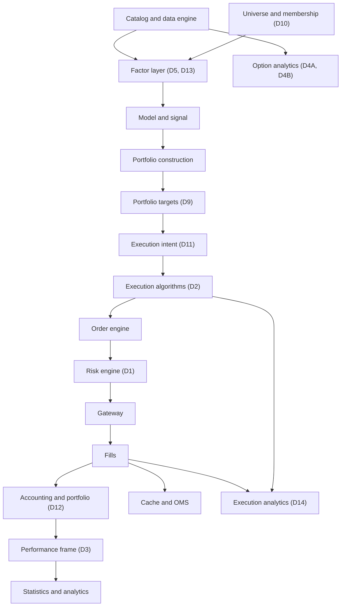
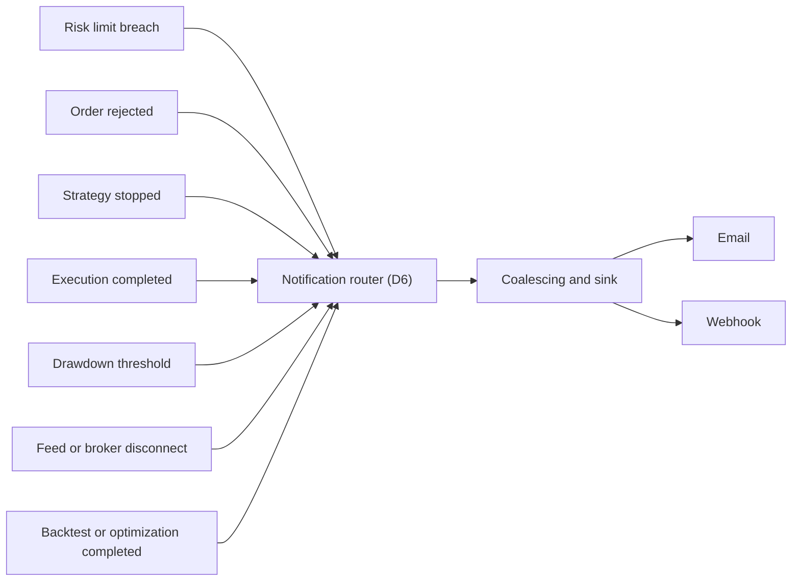

# VeighNa capability review: harvesting trading-system capabilities

Companion to [`vnpy_lessons_implementation.md`](vnpy_lessons_implementation.md). The later
[`vectorbt_lessons_design.md`](vectorbt_lessons_design.md) extends the Feature, Label and Dataset
candidate below (D5 and D13) with concrete label policies, and records where the two reviews agree
and where they diverge. Throughout, the framework is called VeighNa (vn.py); the former name appears
only where a path or the original request refers to it.

**Primary invariant.** VeighNa contributes capabilities to the components of this architecture; it
does not dictate the architecture of those components. Every item below is stated as a capability
gap in NautilusTrader that VeighNa either exposes or closes, never as a port of a VeighNa subsystem.

**Status.** Design review, revised after review feedback. No production code changes accompany this
document. The revision added the layer taxonomy, the state-ownership invariants, the dependency
graph, the split of the options work, three new decisions (D11, D13, D14), and a restated position
with respect to the existing portfolio construction and universe workstreams; the record of what
changed is in section 1.2 of the companion document.

## 1. Purpose and scope

VeighNa (formerly vn.py) is the most widely used open source Python trading framework in the Chinese
retail and proprietary trading market, and it has existed since 2015. It is the closest thing to a
peer of this project in scope: an event-driven engine, a strategy host, a backtester, an optimizer, a
risk layer, live trading adapters, and an options analytics application.

The question this review asks is: **which trading-system capabilities should this project acquire,
and where do they belong, given what VeighNa implements and what this project already is.**

### 1.1 The harvesting rule

This is not a port and not a feature list. VeighNa is a desktop product with a Python core, mutable
global state, runtime plugin discovery, a compiled extension only where the hot path forced the
maintainers to write one, and floating point money. This project is a library and a runner with a
Rust core, typed state, compile-time integration and fixed point money. Several of the items below
exist because the comparison made an internal gap visible, not because VeighNa supplies a mechanism,
and the decisions table in section 12 records that provenance explicitly.

Two constraints are binding.

1. **The United States rule.** The rule is not "only United States concepts". It is:
   United States market semantics are required wherever an item touches a market rule;
   market-agnostic mechanisms are permitted; foreign-market-specific semantics are prohibited. Risk
   caps, factor pipelines, execution algorithms, volatility surfaces and optimization are
   market-agnostic mechanisms and may be adopted without importing any Chinese market convention.
   The open and close offset model, settlement prices, exchange price limits, foreign exchange and
   product enumerations, and foreign calendar and year conventions are prohibited, and no accepted
   item may depend on them.
2. **Defects only.** The authorising instruction permits code changes only for defects. Items
   accepted below are specified, ordered and given acceptance criteria; they are not implemented by
   this workstream. Section 5 of the companion document records the defect checks performed and their
   outcome.

## 2. Method and evidence

The review was performed against source, not documentation or secondary commentary.

| Source                    | Revision                                                  | Size                          |
| ------------------------- | --------------------------------------------------------- | ----------------------------- |
| `vnpy/vnpy`               | `fa5206fe63836f3f8cd1ebd7168fbd19a5e2ff09`, version 4.4.0 | 60 Python files, 12,840 lines |
| `vnpy/vnpy_ctastrategy`   | clone of `main`                                           | 20 files, 5,053 lines         |
| `vnpy/vnpy_ctabacktester` | clone of `main`                                           | 7 files, 2,067 lines          |
| `vnpy/vnpy_algotrading`   | clone of `main`                                           | 14 files, 1,704 lines         |
| `vnpy/vnpy_riskmanager`   | clone of `main`                                           | 16 files, 1,666 lines         |
| `vnpy/vnpy_optionmaster`  | clone of `main`                                           | 20 files, 5,778 lines         |

The core repository contains only `vnpy/trader` (22 files, 6,523 lines), `vnpy/event` (2 files, 153
lines), `vnpy/alpha` (25 files, 4,680 lines), `vnpy/chart` (6 files, 1,133 lines) and `vnpy/rpc` (4
files, 327 lines). Every application named in the project README is a sibling repository loaded at
runtime as a plugin, so those were cloned separately. The plugin model is itself an observable fact
of the design: a small core and a federated application surface.

Repository scale, as context rather than as an argument: 45,667 stars, 12,511 forks, MIT licence,
created 2015-03-02, last push 2026-09-13. Releases are rare and deliberate: 4.0.0 (2025-03-28),
4.1.0 (2025-06-17), 4.2.0 (2025-11-01), 4.3.0 (2025-12-24), 4.4.0 (2026-05-14). Release notes are
cited below as evidence of what the maintainers consider load-bearing and of the defects they have
had to repair in the areas this review touches.

`L` marks a candidate learning, `D` a decision.

## 3. What VeighNa is, mechanically

Four properties describe the framework closely enough to reason about it.

**A synchronous event bus with a wall-clock timer.** `EventEngine` (`vnpy/event/engine.py`) owns one
`Queue`, one consumer thread, and a timer thread emitting `EVENT_TIMER` once per second. Gateways
push data through `on_event`, which wraps the payload in an `Event` whose type is a string, suffixed
per symbol and per order id so subscribers can filter without inspecting the payload. Everything
downstream, including risk checks and execution algorithms, is driven by that queue and that timer.

**One mutable global object graph.** `MainEngine` (`vnpy/trader/engine.py`) is a registry of
engines, applications and gateways. `OmsEngine` keeps plain dictionaries of ticks, orders, trades,
positions, accounts, contracts and quotes and derives active orders from the order dictionary.
Orders carry a `reference` string identifying the strategy that sent them, and dispatch to a strategy
is by that string.

**Applications as plugins over the core.** An application is a `BaseEngine` subclass registered with
`main_engine.add_app`. It may monkey-patch core behaviour: the risk manager replaces
`MainEngine.send_order` at runtime. Applications own their own persistence, their own settings files
under `.vntrader`, and their own GUI widgets.

**A flat, untyped data model.** Market and order objects are `@dataclass` types with an `extra`
dictionary for venue-specific fields, an id derivation step in `__post_init__`, and dataclass
generated equality over all fields (`vnpy/trader/object.py`). Prices, quantities and money are
Python floats throughout.

The structural difference that follows from the last two points is the reason most of what follows is
a small set of mechanisms rather than a subsystem port. VeighNa assumes a human at a desktop and
treats the programmatic surface as what the GUI happens to call. This project assumes a library and a
runner and treats the programmatic surface as the product.

## 4. Capability taxonomy

Every candidate is classified into the layer that would own it. This matters because these must not
become one "VeighNa features" subsystem; each layer has its own authority, its own tests and its own
release risk.

| Layer | Domain                    | Owner in this project              | Items                                            |
| ----- | ------------------------- | ---------------------------------- | ------------------------------------------------ |
| A     | Trading safety            | Risk engine, execution engine      | D1, D11 (verification), child-order safety in D2 |
| B     | Execution                 | Execution algorithms, order engine | D2, D11, D14                                     |
| C     | Accounting and analytics  | Portfolio, accounting, analysis    | D3, D12                                          |
| D     | Quantitative research     | Research pipeline, optimization    | D5, D8, D13                                      |
| E     | Derivatives and analytics | Model, option chain, analytics     | D4A, D4B                                         |

Two layers that the review feedback asked to make explicit are already occupied in this project and
are therefore recorded in sections 5 and 9 rather than proposed again:

| Layer | Domain                    | Owner in this project                          | Position                                                                                                |
| ----- | ------------------------- | ---------------------------------------------- | ------------------------------------------------------------------------------------------------------- |
| F     | Portfolio construction    | Target pipeline                                | Mechanism exists (D9); cross-sectional weighting is an adjacent gap that VeighNa does not close         |
| G     | Universe and availability | Universe actors and the catalog                | Membership exists (D10); point-in-time historical membership is an adjacent gap, folded into D5 and D13 |
| H     | Operations                | Event architecture and the notification router | D6                                                                                                      |

## 5. Where NautilusTrader stands today

Every claim in this table was verified against this repository; the companion document carries the
exact lines.

| Area                           | VeighNa                                                                                                                                             | NautilusTrader today                                                                                                                                                                                                                    |
| ------------------------------ | --------------------------------------------------------------------------------------------------------------------------------------------------- | --------------------------------------------------------------------------------------------------------------------------------------------------------------------------------------------------------------------------------------- |
| Bar aggregation                | Tick to minute, minute to hour, day; weekly declared but routed through the daily path                                                              | Time, tick, volume, value, tick and volume imbalance and runs, Renko, and bar from bar, plus historical warm-up events                                                                                                                  |
| Data model                     | Floats, dataclasses, `extra` dictionary                                                                                                             | Typed prices and quantities, a closed `Data` enum, `CustomData` for venue extensions                                                                                                                                                    |
| Catalog and history            | `BaseDatabase` with per-driver plugins, a bar and tick overview per symbol                                                                          | Parquet catalog with typed query, consolidation, and coverage reporting through the catalog CLI                                                                                                                                         |
| Strategy state across restarts | Declared variables scraped to JSON on every trade and restored at init                                                                              | An explicit `on_save` and `on_load` byte-state contract per strategy, gated by `load_state`                                                                                                                                             |
| Pre-trade risk                 | Five rules behind a plugin template, evaluated in Python per order                                                                                  | A Rust engine in the send path: submit and modify rate limits, per instrument notional, reduce only, price and quantity precision, quantity bounds, trading state, typed denial reasons, and an `OrderDenied` event                     |
| Execution algorithms           | TWAP, Iceberg, Sniper, BestLimit, Stop; limit order quoting on a one second timer                                                                   | The `ExecutionAlgorithm` trait, its macro, and one shipped algorithm: TWAP, market orders only, slicing with remainder handling and parent and child linkage                                                                            |
| Execution analytics            | None                                                                                                                                                | None                                                                                                                                                                                                                                    |
| Portfolio construction         | `TargetPosTemplate`, a per-instrument target position reconciler                                                                                    | A signal to sized target to order path with a risk-scaled weight per instrument, plus reconciliation against positions and resting orders                                                                                               |
| Universe and membership        | None beyond a watch list                                                                                                                            | A universe definition with static and scheduled rules, membership change events, and per-universe subscriptions                                                                                                                         |
| Accounting                     | Balance and daily result accounting inside the backtester                                                                                           | A portfolio and account model with realised and unrealised PnL per instrument, margin models per account type, documented in the accounting concept page                                                                                |
| Backtest statistics            | 28 keys from a per day result frame, including drawdown duration and trade cost aggregates                                                          | 34 statistics over a returns or PnL series, with no periodic frame, no drawdown duration, no turnover, commission or slippage aggregate                                                                                                 |
| Optimization                   | Grid and genetic search over a process pool with a shared evaluation cache                                                                          | Grid search behind a `SearchStrategy` protocol, memory driven fan out, experiment digests, stages, persistence and report                                                                                                               |
| Options                        | Black-Scholes, Black-76, a CRR binomial tree for American exercise, implied volatility, a volatility surface, portfolio greeks, a quoting algorithm | Black-Scholes and Black-76 through the cost of carry term, greeks, implied volatility through the `implied_vol` crate, portfolio greeks, a yield curve, option chain data and an ATM tracker; no American exercise model and no surface |
| Factor research                | An operator algebra, a dataset and model pipeline, and the Alpha101 and Alpha158 factor sets                                                        | A research API over the catalog and indicators; no factor layer, no panel or dataset abstraction, no model templates                                                                                                                    |
| Notifications                  | One call site, email and chat channels, per channel interval coalescing                                                                             | None                                                                                                                                                                                                                                    |

Three rows deserve comment, because they are why the accepted list is short. Bar aggregation and the
data model are areas where this project is not merely ahead but built on a different foundation, so
there is nothing to take. Netting and hedging look superficially similar to VeighNa's offset
converter but are not comparable: the converter exists to satisfy Chinese futures offset semantics,
which the United States rule excludes.

## 6. Comparison

| Dimension            | VeighNa                                                                                                              | NautilusTrader                                                                           |
| -------------------- | -------------------------------------------------------------------------------------------------------------------- | ---------------------------------------------------------------------------------------- |
| Language and runtime | Python, with Cython twins for the hot rule and pricing paths                                                         | Rust core, Python extension                                                              |
| Numbers              | Floating point prices and quantities                                                                                 | Fixed point decimals, exact arithmetic for prices, quantities and money                  |
| Extension model      | Runtime plugin discovery, monkey-patching permitted                                                                  | Compile time crates, typed traits                                                        |
| Interface priority   | Desktop GUI                                                                                                          | Library and runner                                                                       |
| Market focus         | Chinese futures, securities and ETF options, plus global futures and a broker adapter                                | Global, multi venue, with United States equities and derivatives among the supported set |
| State                | Mutable global object graph                                                                                          | Typed components with declared authorities                                               |
| Verification         | Manual comparison scripts and smoke tests in places; the strongest artefact is a Python versus Cython parity harness | Regression scenarios with pinned expectations, digests, property tests and benchmarks    |

## 7. Architectural invariants

These are not merely things this review declines to copy from VeighNa. They are rules governing every
future VeighNa-derived capability.

### 7.1 Canonical state ownership

Each piece of state has exactly one authority. A new capability consumes an authority or produces a
value for one; it may not maintain an independent copy of state another component owns.

| Information                    | Authority                                                                                                                          |
| ------------------------------ | ---------------------------------------------------------------------------------------------------------------------------------- |
| Order state                    | Cache and execution engine                                                                                                         |
| Fill                           | Execution engine                                                                                                                   |
| Position                       | Portfolio                                                                                                                          |
| Realised and unrealised PnL    | Portfolio                                                                                                                          |
| Account and margin             | Portfolio and the account model                                                                                                    |
| Risk decision                  | Risk engine                                                                                                                        |
| Bar and aggregated data        | Data engine                                                                                                                        |
| Instrument definition          | Model and the instrument provider                                                                                                  |
| Universe membership            | Universe actor                                                                                                                     |
| Portfolio target               | Target pipeline                                                                                                                    |
| Child order state              | Execution engine                                                                                                                   |
| Execution algorithm scheduling | The execution algorithm instance                                                                                                   |
| Strategy state                 | The strategy state contract                                                                                                        |
| Period performance             | Derived from the portfolio authority by the performance-period reducer (proposed, D3); the frame is a projection, not an authority |
| Factor value                   | The research pipeline (proposed, D5)                                                                                               |

The prohibition that follows: **a VeighNa-derived component may not hold a second authoritative copy
of state that a core component already owns.** The risk counters in D1 are derived counts over events
the risk engine already receives; the period frame in D3 reduces the portfolio's own accounting; the
execution analytics in D14 read fills and orders rather than maintaining a parallel ledger. This is
what prevents drift toward VeighNa's mutable global object graph.

### 7.2 Mechanisms that must not enter the architecture

- Monkey-patching a core method to install a subsystem.
- Signalling rejection with an empty order id and a log line, instead of a typed decision.
- Counters named for a period that live for the process, and cumulative counters that permanently
  block a request shape.
- Important logic in Python on the per order path, with compiled twins used to compensate.
- Runtime plugin discovery from a directory, with `importlib` reload of user files.
- A string expression language evaluated with `eval`.
- Floating point prices, quantities and money, and a general purpose `extra` dictionary on every data
  object.
- Statistics that are undefined reported as zero.
- Manual side-by-side comparison as the verification of pricing mathematics.

### 7.3 Product surface out of scope

The desktop GUI, the chart application, the Excel bridge, the web trader, the RPC service, the script
and notebook REPL, the internationalisation layer, and the account and position manager
applications. These solve distribution and presentation problems this project does not attempt. The
two data applications are already covered by the catalog and the catalog CLI.

### 7.4 Research provenance

A research value is only useful if it can be attributed. Every value produced by the research layers
carries, or can be resolved to, the dataset digest, the feature definition digest, the membership
digest, the as-of timestamp, the source version of the underlying data, and the experiment digest of
the run that produced it. A pipeline may not emit a value it cannot attribute, and an experiment that
cannot be reproduced from its recorded digests is not a result.

### 7.5 Parent and child execution conservation

For every execution algorithm, over the life of a parent order:

```text
parent target = executed quantity + remaining quantity + cancelled unfilled quantity
```

subject to the order state semantics of the execution engine, and the sum of child submitted
quantities may not exceed the parent target unless the algorithm declares an overshoot policy and the
caller authorises it for that parent. This is a hard invariant rather than a test expectation: an
algorithm that can silently exceed its parent, or lose quantity between its schedule and its children,
is not admissible regardless of what it does to the price.

## 8. Candidate learnings

### L1. Pre-trade risk rules: counts, sizes, and repeated orders

VeighNa's risk manager is a list of independent rules evaluated synchronously before an order reaches
the gateway. A rule subclasses `RuleTemplate` (`vnpy_riskmanager/template.py`), declares `name`,
`parameters` and `variables`, implements `check_allowed(request, gateway_name) -> bool`, and may
implement `on_order`, `on_trade` and `on_timer`. The engine discovers rules by scanning a `rules`
directory, persists settings to `risk_manager_setting.json`, subscribes only to the event types a
rule overrides, and replaces `MainEngine.send_order` at runtime. Five rules ship:

| Rule                 | Condition                                                                                             | Default                                                                      |
| -------------------- | ----------------------------------------------------------------------------------------------------- | ---------------------------------------------------------------------------- |
| `ActiveOrderRule`    | Active order count at or above the limit                                                              | 50                                                                           |
| `DailyLimitRule`     | Orders, cancels and fills, per instrument and in total, at or above the limit                         | 20,000 and 10,000 and 10,000 total; 2,000 and 1,000 and 1,000 per instrument |
| `DuplicateOrderRule` | Occurrences of an identical request string at or above the limit                                      | 10                                                                           |
| `OrderSizeRule`      | Volume above the limit, or limit order value above the limit                                          | 500 and 1,000,000                                                            |
| `OrderValidityRule`  | Instrument unknown, price not a multiple of the price increment, volume outside the instrument bounds | none                                                                         |

This project already validates price and quantity precision, price positivity, instrument existence,
quantity bounds, per instrument notional, reduce only semantics and trading state, and denies through
typed reasons carried on an `OrderDenied` event. Three capabilities are absent: a cap on concurrently
active orders, which bounds a malfunctioning strategy without regard to rate; a guard against
repeated identical requests, which catches a loop that stays inside the rate limits; and count caps
over a defined interval for submits, cancels and fills, per instrument and in total.

**Decision D1: adopt the caps, reject the architecture,** and dimension the caps rather than
hard-coding three counters. A cap is a predicate over a scope, a metric and a window:

- scope: global, strategy, account, instrument, venue, or strategy by instrument;
- metric: submit, modify, cancel, fill;
- window: a rolling duration, or the current session where one is defined.

Counters and the decision are separate things, and the separation is what keeps the subsystem
extensible when notional, exposure, volatility, drawdown and concentration limits are added:

```text
RiskCounter  ->  rule evaluation  ->  RiskDecision  ->  OrderDenied or order accepted
```

A counter is state: the observed count for one scope and one metric, timestamped, and derived from
events the risk engine already receives. A rule holds the limit and the window. A decision is an
immutable record: the rule identity, the scope, the observed value, the limit, the window, the
timestamp and the outcome, alongside the strategy and instrument that `OrderDenied` already carries.
The counter is never the decision, and the decision is never a formatted string.

The reset question is resolved by construction rather than by a boundary: a window is a rolling
duration evaluated from event timestamps, so there is no reset to define and no process-lifetime
accumulation. Where a window is the session, the boundary comes from the trading calendar rather than
from a wall-clock day. The repeated request guard is the same mechanism with a canonical request key
as its scope, not a cumulative count that blocks a request shape forever.

### L2. Execution algorithms: passive and aggressive quoting

VeighNa's algo trading application is a template plus five algorithms.

| Algorithm | Mechanism                                                                                                                                                                                                                                                 |
| --------- | --------------------------------------------------------------------------------------------------------------------------------------------------------------------------------------------------------------------------------------------------------- |
| TWAP      | Splits the order over `time` seconds in `interval` second slots, child size `volume / (time / interval)` rounded to the instrument minimum, cancels working orders and re-sends when the touch is reachable, finishes when the timer count reaches `time` |
| Iceberg   | Keeps one child order of `display_volume` working, sends the next when the previous is done, force cancels when the market crosses the order price                                                                                                        |
| Sniper    | On each tick, if the touch is reachable, sweeps at the limit price capped by the displayed size at the touch, cancelling before re-attempting                                                                                                             |
| BestLimit | Joins the touch on the passive side with a child size drawn uniformly from a range, cancels and re-quotes when the touch moves                                                                                                                            |
| Stop      | Watches the last price against a fixed trigger, adds a slippage offset, clamps to the exchange price limit                                                                                                                                                |

The template is a state machine over `RUNNING`, `PAUSED`, `STOPPED` and `FINISHED` with a one second
timer, tick, order and trade dispatch, a working order set, a traded quantity and a volume weighted
traded price, and `finish()` and `stop()` that cancel everything.

This project ships the trait, the macro, a Python template example, and exactly one algorithm, TWAP
in `crates/trading/src/algorithm/twap.rs`. Our TWAP is stricter than VeighNa's on arithmetic and on
the framework contract: it validates its parameters, floors the child size at instrument precision
and carries the remainder as a final slice, verifies that the scheduled sizes sum to the parent
quantity, refuses sizes below the minimum quantity by submitting the whole order instead, and spawns
children through the engine so parent and child are linked. It submits market orders only, so it does
not quote passively or interact with the touch.

**Decision D2: adopt passive and touch aware algorithms,** and state the parent and child
architecture explicitly rather than adding three unrelated algorithms:

- the parent order owns the target quantity, the execution objective and the algorithm state;
- a child order owns its venue order id, price, quantity, status and timestamps;
- the execution algorithm owns scheduling, quoting, cancellation and replacement, and completion.

An iceberg, a quote pegged algorithm and a sniper are worth implementing in Rust behind the existing
macro. A stop algorithm is not adopted because stop and trailing stop orders already exist natively
and a second implementation would be weaker than the existing guarantee. Two requirements are added
over VeighNa, and they are why this is real work rather than a port: child order churn must be
bounded and checked against the risk limits, since the VeighNa algorithms cancel and re-send on every
touch change or slot boundary; and an algorithm must tolerate a child denied by the risk engine,
which VeighNa's model cannot express.

### L3. A periodic result frame and the cost statistics that fall out of it

VeighNa's backtester maintains a per day result carrying close price, start and end position, the day
trades, trade count, turnover, commission, slippage, trading PnL against the previous close, holding
PnL against the day close, total PnL and net PnL. `calculate_result` carries the previous close and
the starting position forward across days and builds a frame indexed by date, and
`calculate_statistics` computes 28 keys from it: day counts including profitable and losing days,
equity including maximum drawdown, drawdown percentage and drawdown duration in calendar days from
the preceding equity peak; totals and per day means of net PnL, commission, slippage, turnover and
trade count; total, annual and mean daily return and return standard deviation, where the daily
return is the log balance ratio against the initial capital; Sharpe, an exponentially weighted Sharpe
with a configurable halflife, a return to drawdown ratio, and a composite ratio; and a final pass
replacing non-finite values with zero.

This project computes 34 statistics over a returns or PnL series and exposes them as per currency PnL,
return and general maps on the backtest result. The portfolio already distinguishes realised from
unrealised PnL per instrument, which is the source the frame should reduce. Absent: the periodic
frame itself, drawdown duration, the exponentially weighted Sharpe, and any aggregate of turnover,
commission or slippage.

**Decision D3: adopt the frame and four statistics, reject the composite.** The frame is a
`PerformancePeriod` record whose fields are grouped by what they are, so that the contract is not a
flat bag of numbers:

- **accounting**: period bounds, starting equity, ending equity, realised PnL, unrealised PnL,
  commission, fees, slippage;
- **trading activity**: volume, turnover, trade count, winning trades, losing trades;
- **exposure**: open position count, gross exposure, net exposure;
- **derived performance**: net PnL, net return, drawdown, drawdown percentage.

The period is emitted by an interval trigger rather than by a backtest callback: a calendar boundary
of day, ISO week or month computed from the configuration and the trading calendar, plus an explicit
flush on shutdown and on demand. A backtest runs the same trigger off the simulated clock, so a live
run and a backtest produce the same rows for the same period and the same accounting. Statistics are
views over that frame rather than independent reductions, so that backtest, live, portfolio and
strategy reporting do not each reconstruct PnL.

Three rules apply. The frame reduces the authorities in section 7.1 and may not become a second
ledger. Undefined is not zero: a statistic that cannot be computed stays unavailable, matching the
existing treatment of a missing objective metric as an error. The composite ratio is not
implemented: it is a weighted combination of six inputs with no external reference.

### L4. Options: exercise style and the volatility surface

VeighNa ships three pricing models as stateless functions, Black-Scholes for spot, Black-76 for
futures, and a Cox-Ross-Rubinstein binomial tree handling American exercise with a fixed step count,
sharing a Newton-Raphson implied volatility solver, with a trading day convention against the
Shanghai exchange calendar. On top of them it builds per instrument data with size scaled greeks, a
chain model, a portfolio model aggregating greeks across the chain, a put call parity correction
deriving the implied forward, an implied volatility curve fitted with a cubic spline, a delta hedging
engine, and a quoting algorithm converting a volatility spread into a price spread through vega.

This project already has more than expected: Black-Scholes and Black-76 through the cost of carry
term, exact and approximate greeks, an implied volatility solver on the `implied_vol` crate with a
Halley refinement step, portfolio greeks, a yield curve, option chain types, an ATM tracker, and
criterion benchmarks for the pricing paths. Two things are missing: American exercise, which matters
because United States listed equity options are American while index options are European; and a
volatility surface, so that implied volatility can be interpolated, compared against a quote, and
used by a quoting rule.

**Decision D4A: adopt an early exercise model,** selected by an exercise style declared on the option
instrument and defaulted to the market convention of the instrument class, so that pricing never
assumes one style for a whole chain. The first implementation is a Cox-Ross-Rubinstein binomial tree
with a configurable step count and a documented convergence bound, which is the smallest thing that
prices an American option correctly. The pricing interface stays model agnostic, so a finite
difference or a more general exercise framework can replace the tree without changing callers. The
interface is the deliverable; the tree is an implementation.

**Decision D4B: adopt a volatility surface as a separate subsystem**, specified rather than named:

- **observations and filters**: bid and ask rather than mid, a minimum bid, a maximum spread, a
  minimum time to expiry, a minimum volume where available, rejected crossed markets, and stale
  quotes rejected by age;
- **coordinates**: total implied variance against log moneyness, with time to expiry as the second
  axis, because total variance in log moneyness is the parameterisation in which the no-arbitrage
  conditions are statements about monotonicity and convexity rather than about the quoted price;
- **interpolation**: monotone and convexity preserving within the quoted region, so the surface
  cannot introduce a butterfly arbitrage that was not in the data;
- **calendar consistency**: for each log moneyness, total variance must be non-decreasing in time to
  expiry;
- **extrapolation**: flat total variance beyond the quoted range rather than a continuation of the
  interpolant, since flat total variance preserves no-arbitrage while an extrapolated spline does
  not, and every extrapolated query is flagged;
- **arbitrage validation**: the monotonicity, convexity and calendar conditions are checked and
  reported, never silently repaired; a surface that fails is refused rather than served;
- **calibration**: on a timer, on new quotes, or on demand, with the trigger and the minimum
  observation count recorded, and a refusal when the observation set is too thin to fit;
- **confidence**: every query returns a fit error from the residuals at the observed points and the
  number of observations contributing.

An arbitrage-free parameterised family, such as a stochastic volatility inspired parameterisation, is
the fallback if the interpolation family cannot satisfy the validation conditions in practice; the
validation conditions, not the interpolation scheme, are the requirement. The parity implied forward
is adopted as a diagnostic input to both parts.

### L5. A factor pipeline between the catalog and a model

VeighNa's alpha module is a research pipeline: a wrapper over Polars expressions with operator
overloading, a string expression engine evaluating factor definitions with Python's `eval`, a hook
for registering custom operators, four operator families (time series per symbol, cross sectional
over the date axis, mathematical, and technical), a dataset template assembling features, a label and
a processor chain computed over segments with multiple processes, processors applied separately on
the inference and learning sides, an abstract model with Lasso, LightGBM and multi layer perceptron
implementations, and a signal strategy backtester replaying bars with a daily mark to market pass.
The factor sets are ports of WorldQuant's Alpha101 and Qlib's Alpha158, both credited.

This project has a research API over the catalog and the indicator library, and no factor layer: no
expression abstraction, no point in time panel, no cross sectional operators, no inference and
learning preprocessing split, and no model templates.

**Decision D5: adopt the shape, reject the implementation,** and name the three concepts so the
pipeline has a contract rather than a utility library:

- a **Feature**, a deterministic transformation of market or reference data;
- a **Label**, a future outcome, such as a forward return, a forward maximum drawdown or a forward
  volatility, defined with the same rigour as a feature;
- a **Dataset**, a point in time panel carrying features, labels, membership, the split, and the
  metadata needed to reproduce it.

Factor definitions must compile to a typed expression tree with a canonical serialisation that
digests stably, so a definition can be pinned by a regression scenario and appear in an experiment
digest. A string expression evaluated with `eval` is unacceptable here. The pipeline lives outside
the event driven engine and execution stays on the normal strategy and execution path. Section 7.1
applies: the factor value is authoritative in the research pipeline and nowhere else.

The factor pipeline is a general research primitive and does not replace existing domain specific
score engines or their contracts. A deterministic score and a learned factor may consume the same
data infrastructure, but they are not one subsystem, and neither may absorb the other.

### L6. Notifications

VeighNa 4.4.0 added `send_notification`, one call site reaching an email engine and a chat engine,
with a per channel interval so messages inside the interval are coalesced. The chat channel is
specific and is not adopted; the mechanism is.

This project has no notification or alert abstraction.

**Decision D6: adopt notifications as an event consumer, not as a sink other subsystems call.** The
architecture is a notification event, a router, coalescing, and sinks. The event set is named:
a risk limit breach, an order rejection, a strategy stop, an execution completion, a drawdown
threshold breach, a data feed disconnect, a broker disconnect, a backtest completion, and an
optimization completion. The router subscribes on the existing event architecture and applies per
sink coalescing with a bounded queue and an observable drop policy, with email and a generic webhook
as the initial sinks and no vendor SDK in the core crates.

### L7. Restart recovery and parameter metadata: already covered

VeighNa declares `parameters` and `variables` as strategy class attributes and uses them for settings,
display, optimization ranges and persistence, flushing declared variables to JSON on every trade so a
restart can restore them. This project has an explicit contract instead: `on_save` returns a per
strategy byte state map and `on_load` receives it, gated by `load_state`, and the optimization
package declares an explicit parameter space rather than scraping attributes.

**Decision D7: no change.** VeighNa's mechanism couples persistence, display and optimization to one
reflection convention and flushes state on the trade path. Ours separates them and makes state an
explicit, versionable artefact.

### L8. Optimization: other search strategies and an explicit objective

VeighNa's optimizer offers a brute force grid over a process pool and a genetic search using DEAP with
configurable population, generation and operator parameters, over a process pool with a manager
dictionary caching evaluations by parameter vector. The cache is the point: a genetic search
re-evaluates descendants across generations, and the cache turns that into a lookup. The 4.1.0
release made the genetic hyperparameters user controllable.

This project defines a `SearchStrategy` protocol, ships grid search only, and already has canonical
parameter digests, memory driven fan out, stages, persistence and a report.

**Decision D8: adopt, behind the existing protocol.** The objective and constraint model already
exists in the analyzer, so this item is the search itself plus two contract additions. The run is
described by its parameter space, objective, constraints, dataset, validation scheme, experiment
digest, seed, search strategy, evaluation cache, results and report. The objective supports composite
and constrained forms over return, risk, drawdown, turnover, trade count and stability, since a
single ratio is an inadequate objective for a trading system.

The validation scheme is part of the run rather than a convention a caller applies afterwards: which
portion of the dataset is used for search, what is held out, and whether the evaluation is a single
split or a walk-forward sequence of fits and out-of-sample windows. Without it, in-sample and
out-of-sample results are indistinguishable in the report, which is the failure mode that makes an
optimizer dangerous. Random and evolutionary strategies are added, deterministic under a seed, with a
memo cache keyed by the existing digest, and a held-out evaluation is never scored by the search.

### L9. Portfolio construction: the mechanism exists, the cross-sectional layer does not

VeighNa's contribution here is `TargetPosTemplate`, a per instrument target position reconciler.
This project already has the equivalent and more: a signal to sized target to order path with a
risk-scaled weight per instrument and reconciliation against positions and resting orders
(`crates/trading/src/target.rs`, `crates/trading/src/target_pipeline.rs`, documented in the target
pipeline concept page and pinned by a parity regression scenario).

What does not exist is the layer between a set of signals and a set of per instrument targets: a
cross-sectional construction step that turns alphas or scores into a weight vector under
constraints, such as equal weight, inverse volatility, volatility targeting, risk parity, minimum
variance, mean variance, and factor, sector, dollar and beta neutrality, subject to turnover, gross
and net exposure and per name caps.

**Decision D9: no change from VeighNa, and record the adjacent gap.** VeighNa supplies nothing for
the cross-sectional layer, so it is not a VeighNa lesson and does not belong in this review's
accepted set. It is recorded because the comparison made it visible, and it is scheduled only if the
research roadmap calls for it. If implemented, it belongs in the construction stage ahead of the
existing target stage, and it must not become a second targeting mechanism.

### L10. Universe management: membership exists

VeighNa has no universe concept beyond a watch list. This project has a universe definition with
static and scheduled rules, membership change events with reasons, per-universe subscriptions, Python
bindings, and a membership regression scenario.

**Decision D10: no change.** The requirement that survives from the research direction is not
runtime membership, which exists, but whether *historical* point in time membership is available as
data to a backtest or a research panel, which is what prevents survivorship and look-ahead bias in
factor research. That is a question for D5 and D13 and is recorded in section 13.

### L11. Execution intent and policy

Neither project has a shared contract above its algorithms. VeighNa's five algorithms each interpret
their own parameters, and this project's TWAP takes its own parameters at submit time, so nothing
expresses what the caller actually wants from an execution.

**Decision D11: adopt three separate concepts,** because collapsing them is how an algorithm becomes
a dumping ground for strategy specific parameters.

```text
ExecutionIntent   = what the caller wants            (buy 10,000 shares)
ExecutionPolicy   = the constraints and preferences  (maximise passive, 30 minutes, 15 bps)
ExecutionAlgorithm = how the system attempts it      (iceberg)
```

An intent is the order the strategy wants executed. A policy carries urgency, a participation rate, a
price or slippage constraint, a passive or aggressive preference, and a duration or horizon. An
algorithm is one way to satisfy the pair, and it declares which parts of a policy it can honour. An
algorithm that cannot honour a policy must refuse the order rather than silently relax the
constraint, and the policy is validated at submit time in the same way TWAP validates its parameters
today, with a denial that names the offending field.

TWAP, VWAP, percentage of volume, arrival price, iceberg, pegged and sniper then implement one higher
level contract rather than each inventing a parameter vocabulary. This is a self-generated
requirement exposed by the comparison, not a VeighNa lesson, and it is the reason D2's algorithms are
worth building once rather than five times.

### L12. A canonical accounting model

VeighNa has no accounting authority outside its backtester: `OmsEngine` holds positions as
dictionaries, and the daily result frame exists only inside the backtesting engine, which is why a
live run and a backtest have different reporting. This project has a portfolio and account model with
realised and unrealised PnL per instrument and margin models per account type, documented in the
accounting concept page.

**Decision D12: formalise the authority rather than add a component.** Position, realised PnL,
unrealised PnL and margin are authoritative in the portfolio and the account model, and the D3 frame
is the only periodic reduction of them. No other component may reconstruct PnL independently, which
is the invariant of section 7.1 applied to accounting.

### L13. A point in time research dataset

VeighNa's dataset is a frame of features and a label with no membership dimension, so a backtest over
its factor data cannot express which instruments were eligible at a past timestamp. This project has
runtime membership but no research panel.

**Decision D13: adopt the dataset contract** as part of D5, carrying membership, point in time
timestamps, the train and test split, and the metadata needed to reproduce the panel. The panel
cannot guarantee that the underlying source data is point in time correct, so the claim is not that
bias is impossible; the claim is that membership and timestamps are dataset invariants that are
checked rather than left to review. A panel that cannot state the membership applying at each of its
timestamps is rejected.

Membership history is stored data, not a rule re-evaluated at a past timestamp: a rule evaluated
today cannot represent an instrument that has since delisted, and the instrument definition needed to
evaluate it may itself no longer be available. The membership rule remains the mechanism that
produces the stored series, and the series is what a panel is built from, persisted in the catalog
alongside the data it describes.

### L14. Execution analytics: measure what the algorithms do

Neither project measures execution quality. VeighNa's algorithms are unmeasured, and this project's
single algorithm is unmeasured beyond the fill realism models in the backtest.

**Decision D14: adopt execution analytics** as the counterpart of D2, with three families:

- arrival price metrics: implementation shortfall, arrival slippage, decision price slippage;
- execution quality metrics: VWAP and TWAP slippage, midpoint slippage, spread capture, adverse
  selection, fill ratio, cancel ratio;
- parent and child metrics: completion time, child count, child churn, mean child lifetime, partial
  fill ratio and price improvement.

Every metric requires a stated reference price, a stated denominator and a stated reference
timestamp, because the metric is otherwise ambiguous. The reference timestamp is one of: the decision
timestamp, the arrival timestamp, the parent submission timestamp, the first child timestamp, or the
benchmark interval start, and it is declared per metric rather than assumed, since "arrival price"
without a timestamp convention is not a definition. This is a self-generated requirement exposed by
the comparison, not a VeighNa lesson: adopting D2 without D14 would leave the algorithms unverifiable
in production.

## 9. Gaps the comparison exposes that VeighNa does not close

Recorded so they are not mistaken for VeighNa lessons, and so they are not silently dropped. None is
accepted by this review; each would need its own justification.

| Gap                                                         | Why it is not a VeighNa lesson                                                          |
| ----------------------------------------------------------- | --------------------------------------------------------------------------------------- |
| Cross-sectional portfolio construction (D9)                 | VeighNa has only a per instrument target reconciler, which this project already exceeds |
| Point in time historical membership for research (D10, D13) | VeighNa has no universe concept at all                                                  |
| Execution analytics (D14)                                   | VeighNa publishes no execution quality measurement                                      |
| Objective and constraint modelling for optimization (D8)    | VeighNa optimises a scalar score over a parameter grid with no constraint concept       |
| A surface with arbitrage guarantees (D4B)                   | VeighNa fits a spline and reports no fit quality or arbitrage check                     |

## 10. Dependency graph

The layers and their direction of dependency. Core execution, risk and accounting infrastructure must
never depend on the research subsystem: the research layers produce values that reach execution as
data at the application level, through a target, and never as a code dependency from an execution
component back into research.



Notifications are a consumer of the event architecture rather than a node in that graph:



## 11. Recommended order

Phased so that each phase's acceptance tests can exercise the phase before it.

### Phase 1: safety and accounting

1. **D1, risk caps.** First, because the accounting tests in D3 should exercise the safety-controlled
   execution path rather than bypass it.
2. **D3, the performance frame.** Second, because it establishes the single accounting truth the
   later analytics depend on.

The ordering is logical, not a serialisation of effort: the D3 field and trigger contract can be
developed while D1 is implemented, and D1's denial events are useful input for the accounting event
path that D3 will consume.

### Phase 2: execution

3. **D11, execution intent.** The contract first, so the algorithms are written against it once.
4. **D2, iceberg, quote pegged and sniper.**
5. **D14, execution analytics.** With the algorithms, because an unmeasured algorithm cannot be
   tuned or defended.

### Phase 3: research and optimization

6. **D8, search strategies and the objective model.**
7. **D5 and D13, the factor pipeline and the point in time dataset.**

### Phase 4: operations

8. **D6, notifications.**

### Phase 5: derivatives

9. **D4A, early exercise.**
10. **D4B, the volatility surface.**

Not scheduled: D9 and D10, which exist or are recorded as adjacent gaps, and D7, which is unchanged.

## 12. Decisions

Provenance distinguishes a capability VeighNa supplies from one the comparison exposed.

| Decision | Capability                   | Provenance        | Outcome                                                                                                                                                                                              |
| -------- | ---------------------------- | ----------------- | ---------------------------------------------------------------------------------------------------------------------------------------------------------------------------------------------------- |
| D1       | Risk caps                    | VeighNa           | Adopt scoped count caps and a rolling repeated request guard in the Rust risk engine, with a structured decision record                                                                              |
| D2       | Passive execution algorithms | VeighNa           | Adopt iceberg, quote pegged and sniper behind the existing macro, with declared parent and child ownership, bounded churn, and denied child tolerance                                                |
| D3       | Performance frame            | VeighNa           | Adopt a `PerformancePeriod` frame reduced from the portfolio's own accounting, and the drawdown duration, exponentially weighted Sharpe, turnover and commission statistics; not the composite ratio |
| D4A      | Early exercise               | VeighNa           | Adopt an exercise style per option instrument and an early exercise model                                                                                                                            |
| D4B      | Volatility surface           | VeighNa, extended | Adopt a surface subsystem with named inputs, filters, interpolation, extrapolation limits, calibration and a confidence measure, and an arbitrage check                                              |
| D5       | Factor pipeline              | VeighNa, extended | Adopt Feature, Label and Dataset contracts and a compiled expression tree with a stable digest; not the evaluated string DSL                                                                         |
| D6       | Notification events          | VeighNa           | Adopt a notification event set, a router, coalescing and email and webhook sinks                                                                                                                     |
| D7       | Restart state                | -                 | No change                                                                                                                                                                                            |
| D8       | Optimization                 | VeighNa, extended | Adopt random and evolutionary strategies with a digest memo cache, and a first class objective and constraint model                                                                                  |
| D9       | Portfolio construction       | Comparison        | No VeighNa change; the mechanism exists and the cross-sectional layer is recorded as an adjacent gap                                                                                                 |
| D10      | Universe                     | Comparison        | No change; runtime membership exists and historical point in time membership is folded into D5 and D13                                                                                               |
| D11      | Execution intent             | Comparison        | Adopt three types above the algorithms: an intent, a policy of constraints and preferences, and an algorithm that refuses a policy it cannot honour                                                  |
| D12      | Canonical accounting         | Comparison        | Formalise: the portfolio and account model is the authority for position and PnL state, and the D3 frame is its only periodic reduction                                                              |
| D13      | Point in time dataset        | Comparison        | Adopt the dataset contract for membership, timestamps and splits as part of D5                                                                                                                       |
| D14      | Execution analytics          | Comparison        | Adopt arrival price, execution quality and parent and child metrics alongside D2                                                                                                                     |

### 12.1 Minimum acceptance per decision

Each decision is independently reviewable against one minimum condition. The detailed tests and
evidence are in the companion record; this table is the design contract.

| Decision | Minimum acceptance                                                                                                                                                      |
| -------- | ----------------------------------------------------------------------------------------------------------------------------------------------------------------------- |
| D1       | A repeated request cannot bypass the rolling guard, and a denial record carries rule, scope, observed value, limit and window                                           |
| D2       | The parent target equals executed plus remaining plus cancelled unfilled, and the sum of child submissions never exceeds the parent without a declared overshoot policy |
| D3       | Frame equity reconciles exactly to the portfolio totals for the same run                                                                                                |
| D4A      | American and European instruments follow their declared exercise style, and the tree price converges as the step count rises                                            |
| D4B      | The surface rejects invalid and stale observations, refuses a failing arbitrage check, and exposes a fit confidence on every query                                      |
| D5       | The same factor definition produces the same digest across processes                                                                                                    |
| D6       | A notification cannot block the trading path, and a saturated sink drops rather than stalls the caller                                                                  |
| D7       | No change required                                                                                                                                                      |
| D8       | The same seed and digest produce the same search sequence, and a held-out evaluation is never scored by the search                                                      |
| D9       | No change required                                                                                                                                                      |
| D10      | No change required                                                                                                                                                      |
| D11      | An algorithm refuses a policy it cannot honour, and a migrated TWAP reproduces its schedule for an equivalent intent                                                    |
| D12      | No component recomputes PnL from prices, and the frame is the only periodic reduction                                                                                   |
| D13      | A panel for a past timestamp cannot contain an instrument that joined later                                                                                             |
| D14      | Every metric declares its reference price, its denominator and its reference timestamp                                                                                  |

Cross-cutting constraints on every accepted item: the United States rule of section 1.1; the
state-ownership invariant of section 7.1; the prohibition on a second ledger or a second targeting
mechanism; and verification strong enough that the item's own test fails without it, with an
independent reference for the numerical items (D3, D4A, D4B, D5, D14).

## 13. Remaining open questions

Five questions were resolved by this revision rather than carried forward: the D1 reset boundary is a
rolling window over event timestamps, so there is no reset to define; the D3 frame is produced by an
interval trigger next to the portfolio authority, with the realised and unrealised split a frame
column rather than a statistic; D4B's interpolation is a monotone and convexity preserving family over
total implied variance in log moneyness, gated by the arbitrage conditions, with a parameterised
family as the fallback; historical membership is stored data rather than a re-evaluated rule; and D11
is three types, with the shipped TWAP migrating onto them.

What remains, in the order it must be settled:

1. **The concrete cap values and their default windows for D1.** The mechanism is settled; the
   numbers are not, and a default that is too low will deny legitimate strategies. Settle before
   implementation, with the values documented next to the configuration.
2. **The D2 policy vocabulary.** Which constraints an algorithm must honour, and which it may refuse.
   This defines how much of D11 an algorithm can implement, so it precedes the algorithms.
3. **The D4B calibration trigger and minimum observation count**, since they decide when a surface is
   refused rather than served, and a refusal must not stop a quoting strategy unexpectedly.
4. **Whether the D5 and D13 research layer belongs in this repository** or in a sibling package that
   depends on it, given that nothing in the engine depends on it.
5. **Whether the D9 cross-sectional layer should be scheduled at all.** It remains a recorded
   adjacent gap with no stated research requirement behind it.
6. **Whether the D1 caps and the D2 algorithms share a configuration surface**, or whether caps stay
   in the risk engine configuration and the algorithm takes its policy at submit time.
7. **The D14 metric thresholds, if any.** Whether the analytics merely report and pin values, or
   whether any metric becomes a gate, which would make it a risk rule and place it in D1 rather than
   in the analytics.
